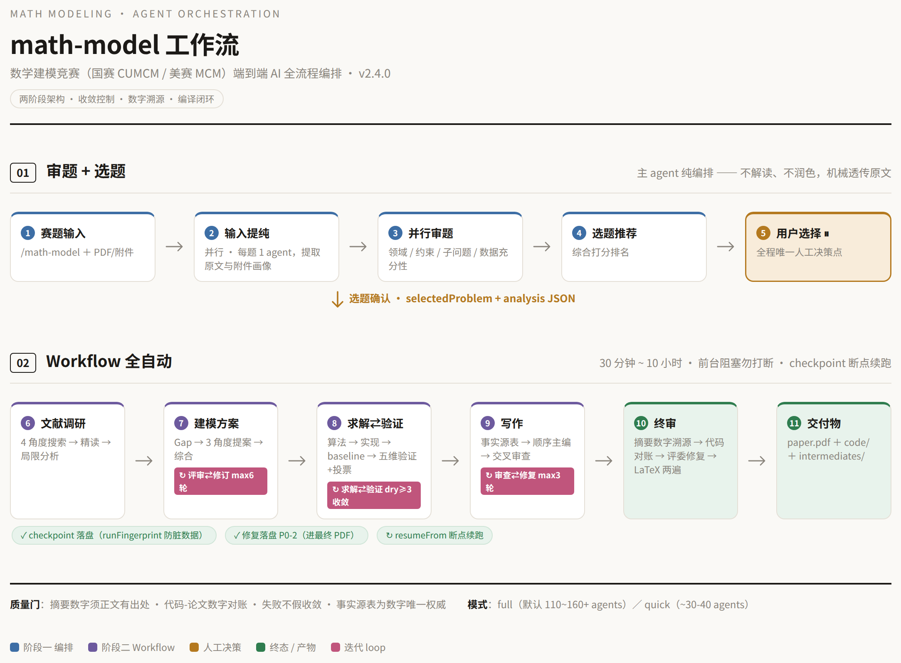

<p align="center">
  
</p>

# math-model — 数学建模竞赛 AI 全流程编排

<p align="center">
  <strong>给题 → 选一道 → 论文 PDF 自己出来</strong>
</p>

> **审题、查资料、建模、求解、验证、写论文、排版——几百个 AI 助手分工协作，最后直接给你一份能提交的 PDF。**
>
> 它不会"写一篇论文交差"——它像一支纪律严明的参赛队：方案要过专家评审团，结果要多角度验证，摘要里**每一个数字都要能在正文找到出处**。每一轮都是"挑毛病 → 改"，直到挑不出毛病。

<p align="center">
  <a href="#-快速开始"></a>
  
  
  
  
</p>

---

## 工作流程一览



**两步走**：第一步**审题 + 选题**（AI 帮你把题目读透、给出推荐，唯一要你做的决策就是选哪道题）；第二步**全自动执行**（查资料 → 建模 → 求解验证 → 写论文 → 终审，几个反复打磨的环节都内置了停止条件，不会无限循环）。

---

## 它解决什么问题

直接问 AI"帮我做一道数模题"时，你通常得到：一篇泛泛而谈的思路、**没法验证的数字**、靠猜的论文格式。而数模竞赛的评分逻辑是——**正确性第一，数据说话，摘要一锤定音**。

math-model 把"一个人 + 一个 AI"变成"**一支分工明确的 AI 参赛队**"：

| 直接问 AI | 用 math-model |
|---|---|
| 一篇"看起来对"的思路 | 一步步帮你审题 → 推荐选题 → 你拍板 |
| 数字可能是编的 | **每个数字都有正文出处，并和代码真实运行结果核对过** |
| 方法自说自话 | 专家评审团反复改稿（最多 6 轮）后才动笔 |
| 论文格式靠猜 | 国赛论文模板 + 排版编译检查 |
| 跑一半断掉就白干 | 自动存档、随时续跑，换题自动拒绝旧数据 |

---

## 使用示例

```
你:   /math-model
      （拖入 2025 年 C 题 PDF + 附件目录）

AI:   已读完 3 道题并完成分析。
       推荐选题：C 题（数据齐全、容易求解、有创新空间）
       请选择题目（A / B / C）……

你:   C

AI:   已开始全自动执行（完整模式，预计 1-3 小时，期间请勿打断）。
       完成后你会得到：论文 PDF + 可复现代码 + 中间产物。
       （进度：查资料 → 建模评审 …）
```

跑完后会告诉你：用了什么方法、和常规做法比结果如何、改了多少轮、PDF 在哪，以及**论文里的数字和代码结果核对的情况**。

---

## 快速开始（30 秒）

```bash
git clone git@github.com:Miaotofu01/Math-Model-SKILL.git ~/math-model-skill
bash ~/math-model-skill/install.sh
```

然后在任意会话里输入：

```
/math-model
```

完事。剩下的由 AI 队接管。

---

## 功能亮点

- **审题选题自动化**：输入提纯 → 并行审题 → 选题推荐，你全程只做一次决策——选哪道题
- **多小问逐问处理**：一道题好几个小问时自动拆开，每一问独立建模、求解、写解答，符合逐问评分的规则
- **建模与求解闭环**：建模方案过专家评审（最多 6 轮改稿）；求解代码真实运行并多角度验证，不达标就继续改，直到挑不出毛病
- **摘要数字溯源 + 代码核对**：摘要每个数字在正文有出处，而且和代码实际跑出来的结果一一核对
- **论文模板内置**：国赛格式固化在模板里，直接产出合规 PDF（摘要无编号、页边距、附录、支撑材料清单 + AI 使用声明都符合规范，换赛题不用改模板；美赛走独立英文路径）

---

## FAQ

**跑一次要多久？多少钱？**
30 分钟 ~ 10 小时（完整模式通常按小时算）。完整模式一次约 110~160 个 AI 助手、耗不少额度；快速模式压到 30-40 个，适合先出个初稿验证思路。花费大头在求解和验证的反复打磨——问题越难越贵。

**和"直接让 AI 做一道题"到底有什么区别？**
直接问会得到"看起来对"的结果，这套流程把**正确性变成了检查项**：数字必须有出处、方案必须过评审、代码必须真跑、论文必须能编译通过。

**中途失败了怎么办？**
每个环节做完都会自动存档（带运行标记），从断点继续跑，不用从头再来。换题目、换参数会自动拒绝旧存档，不会把上一次的结果串进来。

**论文格式合规吗？**
国赛模板内置往届实战经验：摘要专用页、不超过 20 页、不含参赛身份信息、支撑材料清单、AI 工具使用声明，排版编译两遍出 PDF。

**支持美赛吗？**
支持（`competition: "mcm"`）：英文写作、美式摘要页、美式纸张、英文引用格式。

---

## 安装（详细）

### DeepSeek Harness（推荐）

```bash
bash ~/math-model-skill/install.sh --dsh
# 或手动：ln -sfn ~/math-model-skill/skills/math-model ~/.dsh/skills/math-model
```

用链接方式安装：只维护一份代码，改一处所有地方同步生效，不用重复拷贝。

### Claude Code

```bash
bash ~/math-model-skill/install.sh --claude
```

### 环境依赖

| 依赖 | 用途 | 缺失影响 |
|---|---|---|
| `pdftotext`（poppler-utils） | 读取 PDF 里的题目文字 | 只能手动粘贴题目 |
| `xelatex` + ctex（TeX Live） | 论文排版成 PDF | 无法产出 PDF |
| `python3` + numpy/scipy/pandas/matplotlib/openpyxl | 运行建模代码 | 无法执行求解 |
| Noto Sans CJK SC 字体 | 图表里的中文 | 中文显示为方框 |

安装脚本会自动检测这些依赖，缺了什么会告诉你怎么办。

---

## 配置

常用可调参数：

| 参数 | 说明 |
|---|---|
| `competition` | `"cumcm"`（国赛，默认）／ `"mcm"`（美赛：英文、美式摘要页） |
| `mode` | `"full"`（完整模式，默认，约 110~160 个 AI 助手）／ `"quick"`（快速模式，约 30-40 个） |
| `templateDir` | 论文模板目录；不填会自动找 |
| `outputDir` | 结果输出到哪（默认 `./math-model-output`） |
| `resumeFrom` / `skipPhases` | 从上次中断处继续 / 跳过某些环节 |
| `innovationStrictness` | `strict` / `standard` / `loose`（对"创新点"的严格程度） |

**预计耗时**：30 分钟 ~ 10 小时，主要看反复打磨和代码运行的耗时，问题越难越久。运行期间请勿打断；中断了用 `resumeFrom` 接着跑。

---

## 目录结构

```
math-model/
├── skills/math-model/            # 技能本体（一份代码两处用）
│   ├── SKILL.md                  # DeepSeek Harness 版说明
│   ├── SKILL.claude.md           # Claude Code 版说明
│   ├── prompts/                  # 审题阶段的三份指令
│   ├── templates/                # 论文模板 + 组装工具
│   └── workflows/                # 主流程脚本 + 元数据
├── install.sh                    # 一键安装（--dsh / --claude / --both）
├── env-check.sh                  # 环境依赖自检
├── docs/                         # 总览图（图片版 / 流程图代码 / 网页版）
└── .claude-plugin/plugin.json
```

---

## 变更历史

- **v2.4.0**：修掉一个会导致国赛流程中途崩溃的 bug；AI 各环节的修改现在会真正写进最终 PDF；自动存档加了运行标记防串数据；模板路径自动定位；快速模式；修掉多处"看起来在检查其实没检查"的质量门
- v2.3.0：写作环节重构（先定事实清单，按顺序一章章写，再交叉检查）
- v2.2.0：同步实际运行版本、修文档和代码不一致、删无用代码


---

## License

MIT
