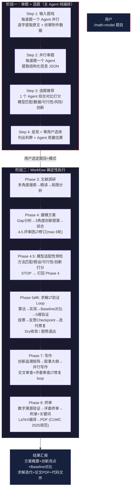
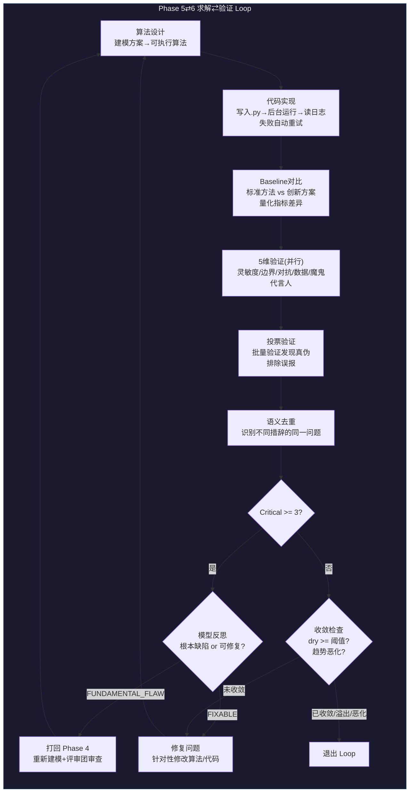

<p align="center">
  
</p>

# math-model —— 数学建模竞赛 AI 全流程编排插件

<p align="center">
  <strong>国一导向：正确性第一、数据说话、摘要一锤定音</strong>
</p>

一个基于 Claude Code 的 AI Agent 编排插件，为**数学建模竞赛（国赛 CUMCM / 美赛 MCM）**提供从审题、选题、文献调研、建模方案设计、求解验证到论文写作的端到端全流程自动化支持。

> **v2.2.0** | 两阶段架构 | 主 agent 编排 + Workflow 全自动执行

> ⚠️ **关于"三种模式"**：早期 README 宣传 quick/standard/thorough 三种深度。实际代码中 `mode` 参数已接受但**尚未实现差异化**--无论传哪种 mode，workflow 都跑同一套完整流程（cfg 硬编码）。三种深度为规划中的能力，下文相关描述为设计目标而非当前行为。

---

## 目录

- [这个插件是干什么的？](#这个插件是干什么的)
- [优点与特色](#优点与特色)
- [运行流程](#运行流程)
- [安装方式](#安装方式)
- [如何使用](#如何使用)
- [输出结构](#输出结构)
- [注意事项](#注意事项)
- [License](#license)

---

## 这个插件是干什么的？

数学建模竞赛的三天赛程中，队伍面临巨大压力：读题理解、选题决策、文献调研、模型设计、代码实现与验证、论文撰写——每一步都依赖专业知识和大量时间。一个错误的选题或模型设计方向，可能导致三天努力付诸东流。

**math-model** 是一个**全自动**数模竞赛 workflow：你提供赛题 PDF，选择题目和模式，剩下的全部由 AI Agent 自动完成——审题、选题、文献调研、建模、写代码求解、验证、写论文、LaTeX 排版——最终直接产出 PDF。

- **不是聊天助手**——你不需要和它"讨论"怎么做。它是一个确定的编排脚本，数百个 Agent 按预设流程自动协作，你只需在选题环节做一次决策。
- **不是"写出论文就行"**——它内建了评审团审查、Baseline 对比、收敛控制、数字溯源等学术质量控制机制。论文不是生成出来的，是一轮轮审查和修订打磨出来的。
- **三种深度可调**：从 ~20 个 Agent 的快速练习到 ~600-1000 个 Agent 的冲奖模式，按需选择。

适用场景：

| 场景 | 推荐模式 | 说明 |
|------|----------|------|
| 快速模拟练习 | `quick` (~20 agents) | 快速走完选题→建模→写作，熟悉工具和流程 |
| 正常比赛 | `standard` (~250 agents, 默认) | 完整流程，含 Baseline 对比、评审团审查 |
| 正式冲奖 | `thorough` (~600-1000 agents) | 火力全开，最严格的验证和最深的迭代 |

---

## 优点与特色

### 全自动端到端：你只做一次决策，其余全部自动

提供赛题 PDF，workflow 自动完成审题、选题推荐、文献调研、建模方案设计、代码求解、结果验证、论文撰写、LaTeX 排版。整个流程你只需要做一件事：**在选题环节确认选哪道题和什么模式**。选完之后，等着收 PDF 就行。


### 四人格评审团：数学家和工程师有否决权

建模方案在进入求解之前，必须通过四个 AI 评委的审查——**数学家**（推导正确性）、**工程师**（可实现性，三天内代码能跑通）、**领域专家**（方法选择合理性）、**魔鬼代言人**（找最薄弱的攻击点）。数学家和工程师有**否决权**——任何一个不点头，方案打回修订，直到全员通过为止。


### 求解-验证闭环：自动迭代到查不出问题，路线错了就重来

求解产出结果 → 五维度并行验证（灵敏度、边界、对抗、数据校验、魔鬼代言人）→ 投票排除误报 → 修复代码重跑 → 再验证。循环直到连续多轮无新问题。但如果越修越糟，workflow 会**自动止损退出**。更关键的是，严重问题累积到阈值时触发**模型反思**——如果判定是建模路线本身有缺陷，**自动打回重新设计整个方案**，不在错误方向上浪费算力。


### 创新有根有据：5% 必要性测试，不通过就丢弃

创新不是最后硬贴一段"本文的创新点"。workflow 从文献局限分析出发，找到标准方法的共同缺陷（Gap），据此提出多个改进方向，然后运行**标准方法作为 Baseline 做量化对比**。如果改进 vs 标准的差异不到 5%，workflow 会直接判定这算不上有效创新并丢弃。通过测试的创新点沿"文献局限 → 方案设计 → Baseline 数据 → 写作叙事 → 摘要"完整传递，不会半路丢失。


### 摘要数字溯源：每个数据自动验证正文出处

论文完成后，workflow 自动提取摘要中的每一个具体数字，到正文里逐条搜索出处。找不到推导过程的数字，要么补上，要么删除。评委看到的数据，正文里一定能对应上。


### 输入不加工：主 Agent 不读题、不润色、不概括

很多 AI 工具在后台"帮你总结"题目——总结就会丢信息。这个 workflow 的审题阶段：独立 Agent 用 pdftotext 逐字提取原文，另一个独立 Agent 做结构化分析，主控 Agent 只负责把结果原样递交给下一环节。题目长什么样，模型看到的就是什么样。

---

## 运行流程

### 极简架构视图



### 核心 Loop 详解



---

## 安装方式

### 环境要求

| 依赖 | 用途 | 缺失影响 |
|------|------|----------|
| Claude Code ≥ 1.0.0 | 插件运行平台 | 不可用 |
| `pdftotext` (poppler-utils) | 从 PDF 提取题目文字 | 无法用 `/math-model ~/题.pdf`，需手动粘贴题目 |
| `xelatex` + `ctex` | standard/thorough 模式编译 LaTeX → PDF | 只能产出 Markdown（quick 模式不受影响） |
| `python3` + numpy/scipy/pandas/matplotlib/openpyxl/statsmodels/scikit-learn | 求解代码执行 | 无法执行求解，只能产出算法方案 |
| 中文字体 (fonts-noto-cjk) | 国赛论文排版 | 国赛 LaTeX 编译可能失败 |

> 使用 `bash env-check.sh` 一键检测所有依赖。

### 一键安装

```bash
git clone https://github.com/Miaotofu01/Math-Model-SKILL.git
cd math-model
./install.sh
```

安装脚本会自动：

1. **检查系统依赖**：逐项列出 `pdftotext`、`xelatex`、`python3` 和 Python 科学计算库的安装状态，给出缺失项的安装命令
2. **复制插件文件**：
   - `skills/math-model/SKILL.md` → `~/.claude/skills/math-model/SKILL.md`
   - `workflows/math-model.js` → `~/.claude/workflows/math-model.js`（含 `lib/` 子目录全部模块）
   - `env-check.sh` → `~/.claude/skills/math-model/env-check.sh`
3. **自动运行环境检测**并输出结果

### 手动安装

```bash
# 安装系统依赖（Ubuntu/Debian）
sudo apt install poppler-utils texlive-xetex texlive-lang-chinese python3 python3-pip fonts-noto-cjk
pip3 install numpy scipy pandas matplotlib openpyxl scikit-learn statsmodels

# 安装插件文件
PLUGIN_DIR="$(pwd)"
mkdir -p ~/.claude/skills/math-model ~/.claude/workflows
cp "$PLUGIN_DIR/skills/math-model/SKILL.md" ~/.claude/skills/math-model/SKILL.md
cp "$PLUGIN_DIR/workflows/math-model.js" ~/.claude/workflows/math-model.js
cp -r "$PLUGIN_DIR/workflows/lib" ~/.claude/workflows/lib
cp "$PLUGIN_DIR/env-check.sh" ~/.claude/skills/math-model/env-check.sh
```

### 卸载

```bash
rm -rf ~/.claude/skills/math-model ~/.claude/workflows/math-model.js ~/.claude/workflows/lib
```

---

## 如何使用

### 基本用法

在 Claude Code 中输入 `/math-model`，然后按提示提供题目：

```
/math-model

题目A: [粘贴题目A的文字描述，或提供PDF/docx文件路径]
题目B: [粘贴题目B的文字描述，或提供PDF/docx文件路径]
附件目录: /path/to/attachments  （可选）
```

### 工作流程

1. **输入题目**：可以粘贴文字、提供 PDF/docx 文件路径、或指定附件文件夹
2. **阶段一自动运行**：插件自动完成输入提纯、并行审题、选题推荐
3. **用户确认**：插件呈现每道题的评分对比和 Agent 用量估算，**等待你选择题目和模式**
4. **阶段二自动运行**：选定后，Workflow 在后台自动执行 Phase 3~8，期间**不要打断**
5. **结果汇报**：完成后汇报建模方案、创新亮点、Baseline 对比、求解迭代、论文路径

### 模式选择

| 触发词 | 模式 | 适合 |
|--------|------|------|
| "练习" / "试试" / "快速" | quick | 熟悉工具、快速走通流程 |
| （默认） | standard | 正常比赛 |
| "正式" / "冲奖" / "仔细" | thorough | 火力全开，最严格的质控 |

### 高级参数

Workflow 启动时可传入以下参数进行精细控制：

| 参数 | 类型 | 默认值 | 说明 |
|------|------|--------|------|
| `dryRun` | boolean | `false` | 仅执行审题+选题阶段，输出执行计划后退出 |
| `innovationStrictness` | string | `'standard'` | 创新必要性阈值：`'strict'`（≥10%）/ `'standard'`（≥5%）/ `'loose'`（≥2%） |
| `resumeFrom` | string | — | 断点续跑，如 `'phase4-modeling'` 从建模阶段继续 |
| `skipPhases` | string[] | — | 跳过已完成的 phase，如 `['literature', 'modeling']` |
| `userFeedback` | string | — | 用户偏好或方向性指示，注入到建模/写作 prompt |
| `userIntervention` | boolean | `false` | 每个 phase 完成后输出摘要到 intermediates/ |

### 完整示例

```bash
# 1. 在 Claude Code 中启动
/math-model

# 2. 提供题目（假设赛题在 PDF 中）
我这里有三个题目的 PDF，在 ~/contest/ 目录下：
- ~/contest/problem-A.pdf
- ~/contest/problem-B.pdf  
- ~/contest/problem-C.pdf
附件在 ~/contest/attachments/

# 3. 等待阶段一完成，查看选题推荐...

# 4. 选择题目和模式
选 A 题，用 standard 模式

# 5. 等待 Workflow 自动执行（约 250 agents，请耐心等待）
#    可以在 /workflows 查看实时进度

# 6. 查看最终产出
```

### Dry-run 模式

想先验证流程能否跑通，而不真正运行耗时建模求解？使用 `dryRun: true`：

```bash
/math-model
题目A: ...
附件: ...
dryRun: true
```

dry-run 会执行审题、选题推荐、生成完整执行计划（含预计耗时、phase 列表、依赖检查结果），输出到 `intermediates/execution-plan.md`。审查计划后再去掉 `dryRun` 正式运行。

### 输出位置

默认输出目录：`~/math-model-output/`

```
math-model-output/
├── paper/
│   ├── paper.tex          # LaTeX 源码
│   └── paper.pdf          # 编译后的 PDF（standard/thorough）
├── code/
│   ├── solution_v1.py     # 求解代码
│   └── ...
├── figures/
│   └── fig_v*_*.png       # 可视化图表
├── data/
│   └── sip_v*_*.csv/json  # 中间数据
├── logs/
│   ├── solution_v*.log    # 求解运行日志
│   └── MODEL_RETHINK_ALERT.txt  # 模型反思警报（如有）
└── intermediates/
    ├── 03-search-*.json        # 文献搜索
    ├── 03-limitation-analysis.txt
    ├── 04-gap-analysis.txt
    ├── 04-final-model.json     # 最终建模方案
    ├── 04-critique-*.txt       # 评审团反馈
    ├── 04-revised-model-*.json # 修订后的方案
    ├── 05-baseline-*.txt/json  # Baseline 对比
    ├── 05-writing/             # 写作中间产物
    └── 06-final/               # 终审产物
```

---

## 注意事项

- **PDF 题目自动用 `pdftotext` 提取文字**，无需手动转换格式
- **阶段一结束后会停下来等你确认**——选题决策需要你参与，workflow 不会替你选
- **阶段二 Workflow 跑在后台**，期间不要打断；可通过 `/workflows` 查看实时进度
- **standard/thorough 模式自动编译 LaTeX → PDF**（需安装 xelatex + ctex）
- 所有阶段的中间产物保存在 `intermediates/` 下，可追溯每一步的决策和输出
- **摘要每个数字自动验证正文出处**：不可溯源的数字会被自动删除或补推导
- **写作不是一次成稿**：交叉审查 + 评委视角并行 → 修复 → 再审查 → 收敛后才输出
- **CUMC 2025 格式规范内建**：A4/2.5cm 页边距、摘要第一页含关键词、无目录、匿名性、参考文献规范、附录含全部源代码——自动注入，不依赖题目包附带规则文件

---

## License

MIT © 红豆

---

<p align="center">
  <sub>Built for CUMCM & MCM competitors who want to focus on ideas, not boilerplate.</sub>
</p>

---

## 故障排查

### LaTeX 编译失败

**症状**：standard/thorough 模式最终没有产出 PDF，只有 Markdown。
**原因**：`xelatex` 未安装、缺少中文字体、或 ctex 宏包不完整。
**解决**：
```bash
sudo apt install texlive-xetex texlive-lang-chinese fonts-noto-cjk
# 安装后重新运行即可（Workflow 会自动重试编译）
```

### Python 求解代码报错

**症状**：Phase 5-6 循环中代码运行失败。
**原因**：缺少 Python 依赖库。
**解决**：
```bash
pip3 install numpy scipy pandas matplotlib openpyxl scikit-learn statsmodels
```

### PDF 题目提取为空

**症状**：`pdftotext` 运行后题目原文为空。
**原因**：扫描型 PDF 没有内嵌文字层（图片式 PDF）。
**解决**：手动粘贴题目文字即可，或先用 OCR 工具（如 `tesseract`）识别。

### 模型反思循环（FUNDAMENTAL_FLAW）

**症状**：Phase 5-6 反复触发模型反思，不断回到 Phase 4 重设计。
**原因**：建模方案与题目不匹配 — 可能是方法选择不当或假设过于理想。
**解决**：
- 如果已经重设计 2 次以上，考虑在 `userFeedback` 中给出方向性建议
- 或使用 `innovationStrictness: 'loose'` 降低创新门槛，优先保证方案可行
- 下次运行可加 `skipPhases: ['modeling']` 复用已有 checkpoint

### 写作章节缺失/空白

**症状**：Phase 7 完成后章节数量少于预期，或内容为空白。
**原因**：agent 调用超时或上下文溢出。
**解决**：`resumeFrom: 'phase7-writing'` 续跑写作阶段，Workflow 会基于已有 checkpoint 重试缺失章节。

### Wish to skip a phase and resume?

Use the `skipPhases` and `resumeFrom` parameters together:
```bash
# 假设 Phase 3 之前已完成，从 Phase 4 恢复
resumeFrom: 'phase4-modeling'
# 仅运行 Phase 4 和后续阶段
```

> 注意：跳过的 phase 必须有对应 checkpoint 文件存在，否则会报错提示先完整运行一次。
