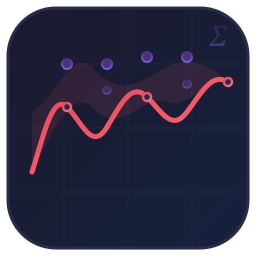
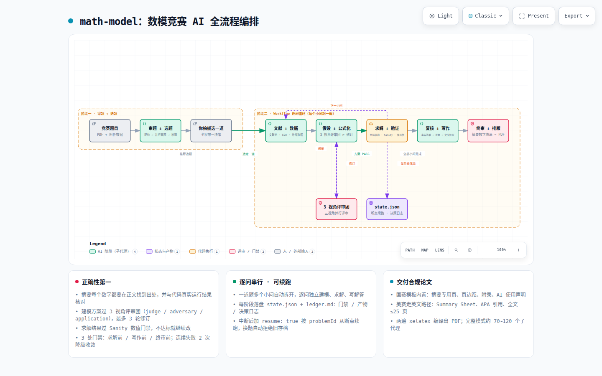
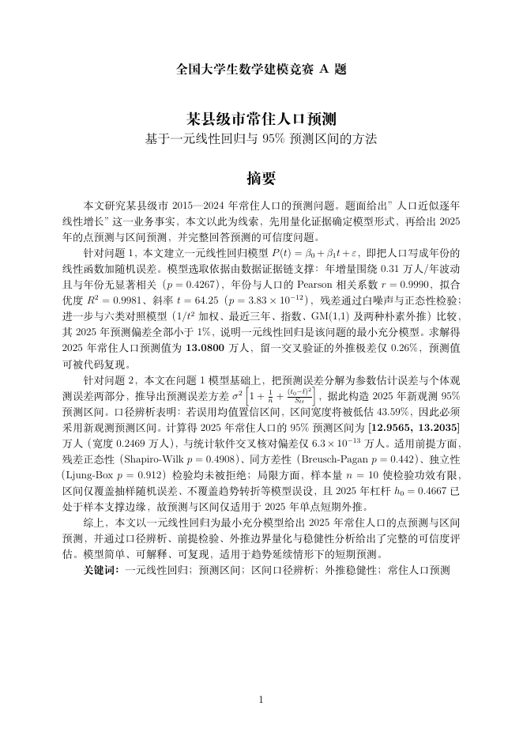
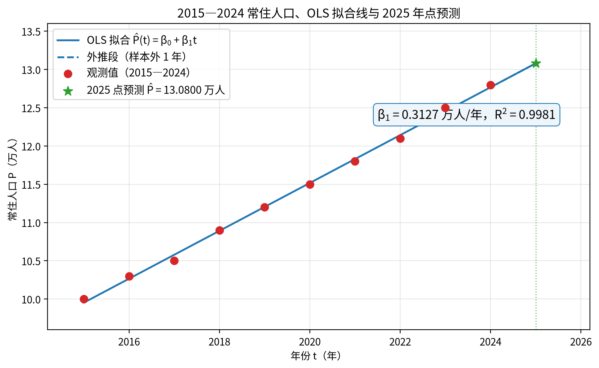
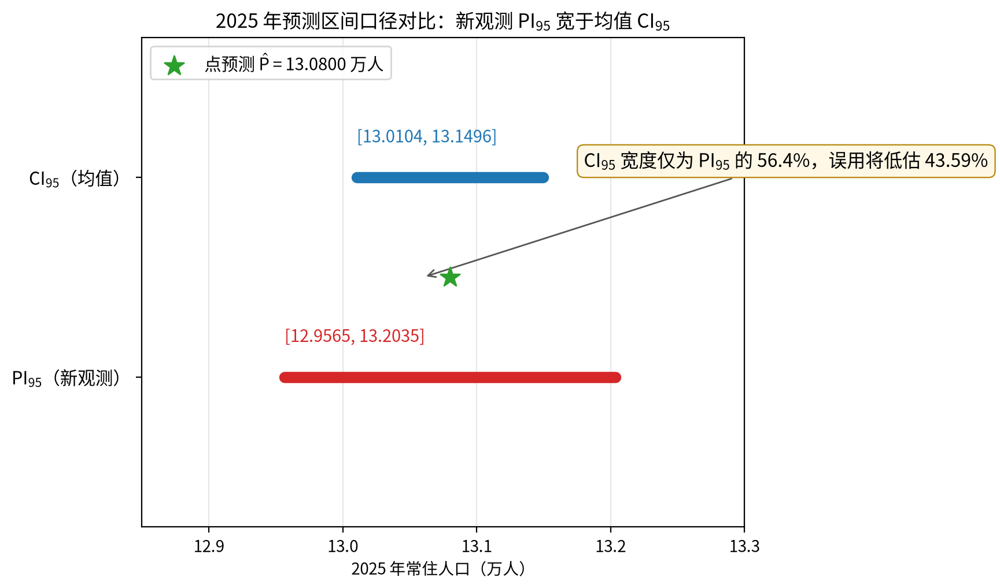
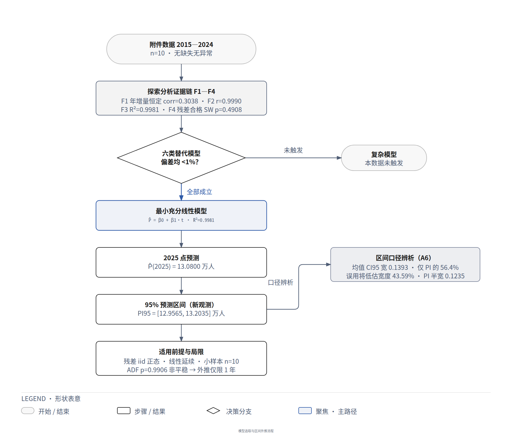
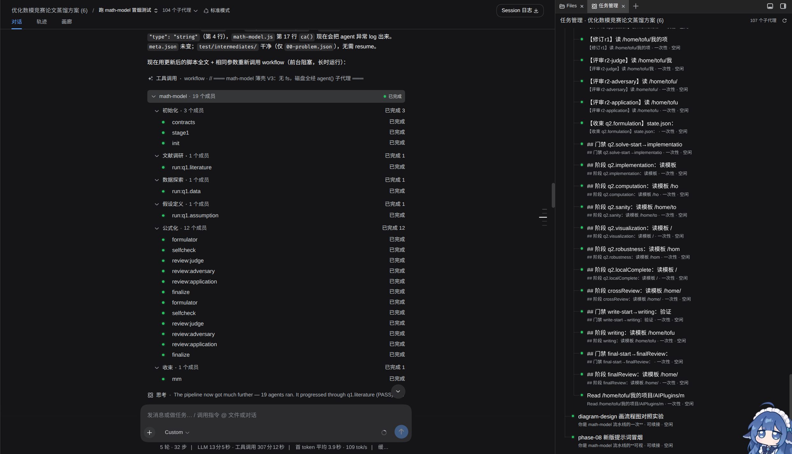

<p align="center">
  
</p>

# math-model — 数学建模竞赛 AI 助手

**只管把数模题目丢给AI，上百个 AI 助手分工协作，查论文、建模、跑代码、写论文、排版，最后直接交给你一份能提交的 PDF。**


<p align="center">
  <a href="#-30-秒上手"></a>
  
  
  
</p>

---

## 为什么选择这个skill

这套系统采用 **workflow**——把任务拆成一组有依赖、有产物的串行环节，每个环节由独立子代理执行，仅注入该环节所需的上下文与规则。

- **抑制 AI 幻觉**：workflow 下每个关键结果（模型参数、预测值等）必须来自真实执行的产物文件（`results.json` 等），子代理只能引用、不能臆造；且建模方案经多角色独立复核，编造无法通过校验。
- **避免上下文污染**：单次对话中所有子任务共用同一上下文，后续推理易被前序内容（含无关文本）带偏（如跨小问结论混用）。workflow 按环节隔离上下文——每个子代理仅见当前小问、相关数据与本环节规则，环节间以落盘产物交接，阻断内容串扰。
- **注意力机制更聚焦**：注意力随输入长度增加而稀释，长上下文会降低对关键信号的聚焦度。环节化后每次调用上下文短而相关，注意力集中在有效信号上，推理更可靠——这也是抑制幻觉与避免污染能成立的原因。
- **可控、可追溯**：每环节落盘真实产物与决策记录文档（`state.json` / `ledger.md`）；支持断点续跑；

---

## 工作流总览



[流程图 html（可交互）](docs/math-model-v3-workflow.html)


1. **审题 + 选题**—— 子agent读题面、附件数据、论文规则，分析每道小题的难度和做法，生成一份报告交给你，让你选择一道题做。
2. **全自动出论文**——查资料 → 建模 → 求解 → 验证 → 写论文 → 终审 → 编译 PDF。

---

## 30 秒上手

```bash
# 1. 克隆这个仓库并安装
git clone git@github.com:Miaotofu01/Math-Model-SKILL.git ~/math-model-skill
bash ~/math-model-skill/install.sh

# 2. 创建工作目录，把题目描述、规则、数据、附件等放进去
# 3. 在会话里输入
/math-model
# 4. 等待5~20小时生成最终结果
```


> 安装脚本会**自动检查环境缺不缺东西**（有没有 LaTeX、Python、中文字体），缺了会告诉你怎么补。

---

## 结果产物


| 产出       | 说明                                       |
| ---------- | ------------------------------------------ |
| 论文 PDF   | 国赛格式：摘要专用页、章节骨架、附录放代码 |
| 结果图     | 曲线/对比/区间图                           |
| 方法示意图 | 说明思路的流程图                           |
| 过程文档   | 每一步的产物、数字来源、决策日志           |

**论文首页**（示例）：



**结果图**：





**方法示意图**：



**运行过程**：



---

## 大概要多久、花多少

- **时间**：5 h ~ 20h，主要卡在建模和求解的计算量上，题目越难越久。
- **AI 用量**：一道题会拆成几个小问，小问越多、跑得越贵。**完整模式**约 100~150 个子任务，**快速模式**约 100 个）。
- 运行**期间不要打断**；实在断了，加 `resume: true` 从断点接着跑。
- **注意**：一次运行会消耗大量token（以deepseek-flash为例，一次运行预计消耗1亿token）请提前做好准备

---

## 常见问题

**中途失败了怎么办？**
每一步完成都会写进一个 `state.json` 状态文件。中断后重跑并加 `resume: true`，从断点继续。它还会记住是"哪道题"的存档——**换题会自动不用旧数据**，不会串。

**论文格式合规吗？**
合规。国赛模板内置：摘要专用页、正文 ≤ 20 页、不含参赛者身份信息、支撑材料清单、AI 工具使用声明，编译两遍出 PDF。

**支持美赛吗？**
支持（英文论文路径）。但美赛目前走的是**手动兜底**流程，国赛是主推、最稳的。


---

## 环境依赖

| 依赖                                      | 干嘛用              | 缺了会怎样     |
| ----------------------------------------- | ------------------- | -------------- |
| `pdftotext`（poppler-utils）              | 读题目 PDF 里的文字 | 只能手动粘题目 |
| `xelatex` + ctex（TeX Live）              | 排版出 PDF          | 出不了论文     |
| `python3` + numpy/scipy/pandas/matplotlib | 跑建模代码          | 算不了结果     |
| Noto Sans CJK SC 中文字体                 | 图/文里的中文       | 中文变方框     |

---

## 想自己调参数

由你在 AI 会话里调（工具调用参数），常用四个：

| 参数                   | 是什么                                                |
| ---------------------- | ----------------------------------------------------- |
| `mode`                 | `full`（完整，默认）/ `quick`（快，检查轮少）         |
| `innovationStrictness` | 对"创新点"的严格程度：`strict` / `standard` / `loose` |
| `outputDir`            | 结果输出到哪（默认 `./math-model-output`）            |
| `resume`               | `true` 时从断点续跑（默认 `false`）                   |

---

## 目录结构

```
math-model/
├── skills/math-model/        # 技能本体：操作的说明书 + 各环节模板 + 论文模板
├── install.sh                # 一键安装（--dsh / --claude / --both）
├── env-check.sh              # 环境自检
└── docs/                     # 总览图 + 设计文档
```


## License & 致谢

MIT License。

工具内嵌了第三方技能 **diagram-design**（用于自动画方法流程图），来自 [cathrynlavery/diagram-design](https://github.com/cathrynlavery/diagram-design)，MIT License ©2025 Cathryn Lavery（上游 commit `2724fd2`），完整许可证与来源见 `skills/math-model/tools/diagram-design/` 下的 `LICENSE` / `THIRD_PARTY_LICENSES.md` / `VENDOR.md`。

---

*完整实现细节、历史改动见 `git log` 与 `skills/math-model` 内的设计文档。*
