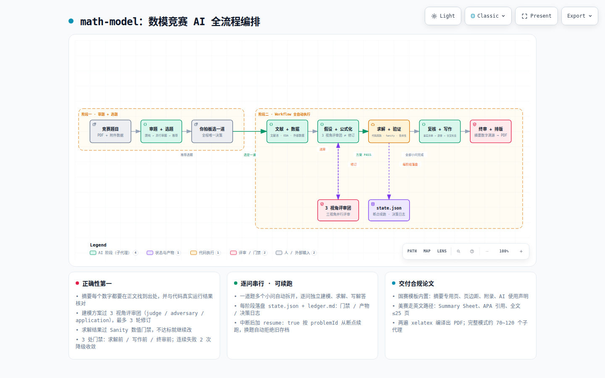

<p align="center">
  
</p>

# math-model — 数学建模竞赛 AI 助手

**把一道数模题丢给它，几十个 AI 助手分工协作，帮你查资料、建模、跑代码、写论文、排版，最后直接交给你一份能提交的 PDF。**

你全程只需要做一件事：**选做哪道题**。剩下全靠它。

<p align="center">
  <a href="#-30-秒上手"></a>
  
  
  
</p>

---

## 它和"直接让 AI 做题"有什么不同

直接问一句"帮我做这道数模题"，你通常得到一篇**看起来挺对、但没法验证**的东西。数模比赛的评分就三点：**做对、数据说话、摘要定生死**。这套工具把这三件事变成**强制检查项**：

| 直接问 AI | 用它 |
|---|---|
| 给你"看起来对"的思路 | 先帮你把题目读懂，列出每道小题怎么做、数据够不够，**再由你决定做哪道** |
| 数字可能是编的 | 方案会先**自己做多轮检查、再让别的 AI 角色独立复核一遍**，挑出毛病才继续 |
| 随便写个模型就完事 | 模型要**真的写代码跑出来**，数字经过多角度验证（正常/极端/扰动情况） |
| 论文格式靠猜 | 内置国赛获奖论文的章节骨架 + 排版模板，摘要里的**每个数字都要能在正文和代码里找到出处**，最后编译出 PDF |
| 跑一半断了重来 | 每一步都自动存档，**中途断了可以接着跑**，换题目会自动拒绝旧存档 |

---

## 它怎么工作（一张图看懂）



> 完整的可交互版本（浏览器打开，可放大、切换主题）：[math-model-v3-workflow.html](docs/math-model-v3-workflow.html)

两步：

1. **审题 + 选题**——AI 把题面、附件数据、论文规则读透，分析每道小题的难度和做法，给你推荐；**你拍板做哪道**。
2. **全自动出论文**——查资料 → 建模 → 求解 → 验证 → 写论文 → 终审 → 编译 PDF。有些环节会反复打磨（比如建模方案多轮检查、结果多角度验证），但都设了**上线，不会无限循环**。

---

## 30 秒上手

```bash
# 1. 克隆这个仓库并安装
git clone git@github.com:Miaotofu01/Math-Model-SKILL.git ~/math-model-skill
bash ~/math-model-skill/install.sh

# 2. 在 AI 会话里输入
/math-model
```

把题目发过去（文字，或让它读题目 PDF），然后照它说的选道题就行。

> 安装脚本会**自动检查环境缺不缺东西**（有没有 LaTeX、Python、中文字体），缺了会告诉你怎么补。

---

## 你会得到什么

一份排版好、能直接提交的论文 PDF，以及全套可追溯的过程记录。

| 产出 | 长这样 |
|---|---|
| 论文 PDF | 国赛格式：摘要专用页、章节骨架、附录放代码 |
| 结果图 | 数据真实跑出来的曲线/对比/区间图 |
| 方法示意图 | 说明思路的流程图（下图为自动生成） |
| 过程记录 | 每一步的产物、数字来源、决策日志，随时能查 |

**论文首页**（示例，来自一次真实运行）：


**结果图**（一张图右上 = 数据拟合 + 预测结果，下图 = 预测区间辨析）：


**方法示意图**（解释"怎么一步步得到答案"的流程图）：


> 上面这些图都是从一次真实运行里截出来的，不是摆拍。

---

## 大概要多久、花多少

- **时间**：30 分钟 ~ 10 小时，主要卡在建模和求解的计算量上，题目越难越久。完整模式通常按小时算。
- **AI 用量**：一道题会拆成几个小问，小问越多、跑得越贵。**完整模式**约 70~120 个子任务，**快速模式**约 25~60 个（检查轮数少）。
- 运行**期间不要打断**；实在断了，加 `resume: true` 从断点接着跑。

---

## 常见问题

**中途失败了怎么办？**
每一步完成都会写进一个 `state.json` 状态文件。中断后重跑并加 `resume: true`，从断点继续。它还会记住是"哪道题"的存档——**换题会自动不用旧数据**，不会串。

**论文格式合规吗？**
合规。国赛模板内置：摘要专用页、正文 ≤ 20 页、不含参赛者身份信息、支撑材料清单、AI 工具使用声明，编译两遍出 PDF。

**支持美赛吗？**
支持（英文论文路径）。但美赛目前走的是**手动兜底**流程，国赛是主推、最稳的。

**"直接让 AI 做"和这套有什么区别，一句话？**
直接问靠 AI 自觉；这套把"做对、有依据、能提交"变成了**流程里强制执行的检查**。

---

## 环境依赖

| 依赖 | 干嘛用 | 缺了会怎样 |
|---|---|---|
| `pdftotext`（poppler-utils） | 读题目 PDF 里的文字 | 只能手动粘题目 |
| `xelatex` + ctex（TeX Live） | 排版出 PDF | 出不了论文 |
| `python3` + numpy/scipy/pandas/matplotlib | 跑建模代码 | 算不了结果 |
| Noto Sans CJK SC 中文字体 | 图/文里的中文 | 中文变方框 |

---

## 想自己调参数

由你在 AI 会话里调（工具调用参数），常用四个：

| 参数 | 是什么 |
|---|---|
| `mode` | `full`（完整，默认）/ `quick`（快，检查轮少） |
| `innovationStrictness` | 对"创新点"的严格程度：`strict` / `standard` / `loose` |
| `outputDir` | 结果输出到哪（默认 `./math-model-output`） |
| `resume` | `true` 时从断点续跑（默认 `false`） |

---

## 目录大概这这样

```
math-model/
├── skills/math-model/        # 技能本体：操作的说明书 + 各环节模板 + 论文模板
├── install.sh                # 一键安装（--dsh / --claude / --both）
├── env-check.sh              # 环境自检
└── docs/                     # 总览图 + 设计文档
```

---

## 需要你自己补的图

上面能自动生成的都贴了。下面这几张我处理不了真实的，**需要你截个图放进来**：

1. **你运行 `/math-model` 后的实际界面**（最能让人"哦原来长这样"）——在会话里输入之后截一张。
   做法：把截图存到 `docs/images/`（比如 `docs/images/usage-screenshot.png`），然后在 `## 30 秒上手` 那段后面加一行：
   ```markdown
   
   ```
2. **（可选）一台配好的环境**——装完 `install.sh`、`bash env-check.sh` 全绿的截图。同样放 `docs/images/` 并加一行引用。

---

## License & 致谢

MIT License。

工具内嵌了第三方技能 **diagram-design**（用于自动画方法流程图），来自 [cathrynlavery/diagram-design](https://github.com/cathrynlavery/diagram-design)，MIT License ©2025 Cathryn Lavery（上游 commit `2724fd2`），完整许可证与来源见 `skills/math-model/tools/diagram-design/` 下的 `LICENSE` / `THIRD_PARTY_LICENSES.md` / `VENDOR.md`。

---

*完整实现细节、历史改动见 `git log` 与 `skills/math-model` 内的设计文档。*
