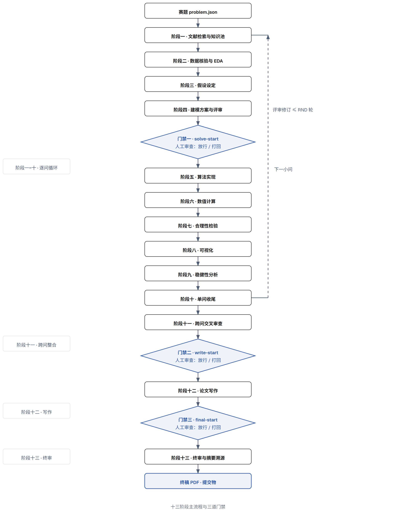
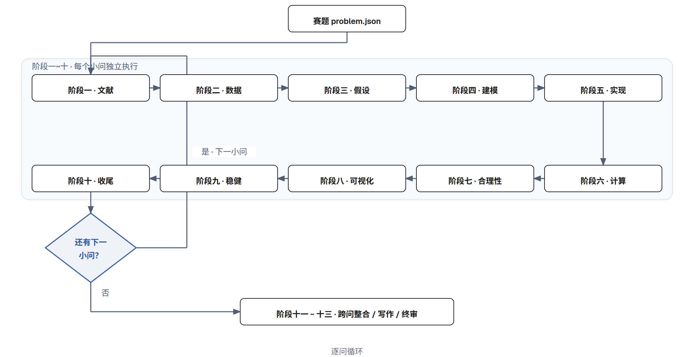
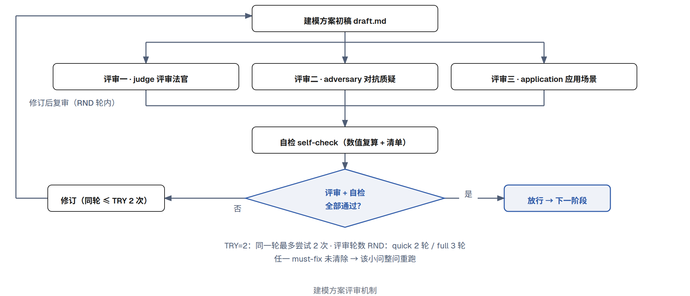
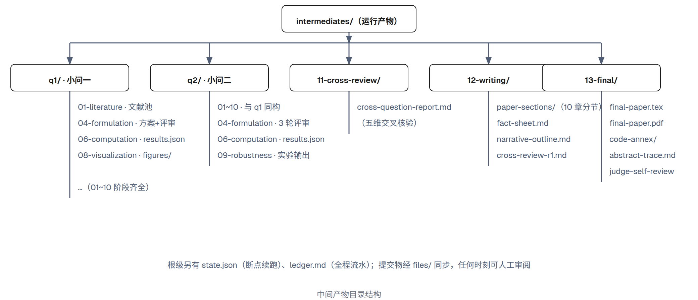
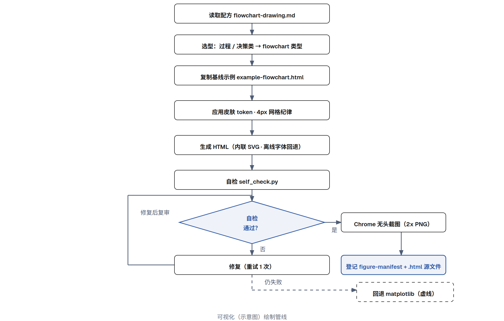
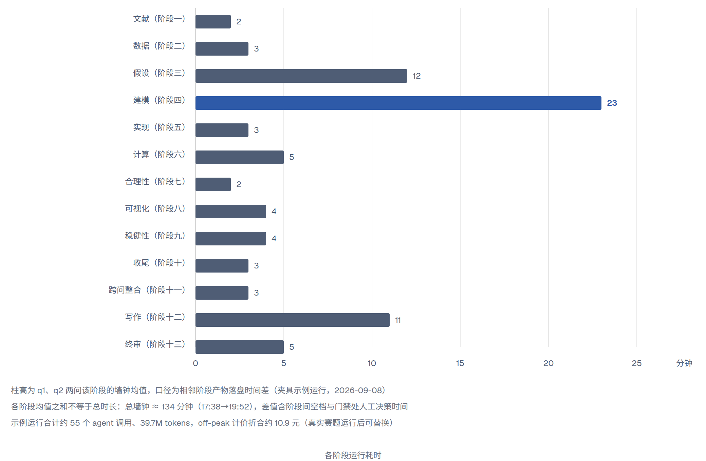

# AI 工具使用详情 · 技术报告

**math-model 工作流：从赛题到论文的自动化建模与写作管线**

- 报告性质：全国大学生数学建模竞赛（CUMCM）《人工智能工具使用规定（2025 年试行）》第 4(2) 条要求的支撑材料《AI 工具使用详情》（提交时导出为 PDF，文件名 `AI工具使用详情.pdf`）；同时兼作本队所用工具链的完整技术说明。
- 依据文件：《全国大学生数学建模竞赛人工智能工具使用规定（2025 年试行）》（全国大学生数学建模竞赛组委会，2025-09-04）。
- 数据口径：本报告第 6、7 章的运行统计与过程实录来自一次**完整夹具示例运行**（`test/` 夹具，两小问人口预测，2026-09-08 17:38–19:52），并明确标注「示例运行」；真实赛题运行完成后，相应章节替换为实际运行数据（正文中以「〈真实运行数据〉」标注替换位）。
- 合规口径：作品的核心建模与分析由参赛队独立完成；AI 工具承担方案检索、数值实现、验证执行与排版等辅助环节；模型选择、假设取舍、结果采纳与终稿定稿等关键决策均在门禁处由参赛队人工做出（详见第 8 章）。

---

## 目录

1. [合规声明与参考文献条目](#1-合规声明与参考文献条目)
2. [使用的 AI 工具与版本](#2-使用的-ai-工具与版本)
3. [工作流总体机制](#3-工作流总体机制)
4. [各阶段流程与技术细节](#4-各阶段流程与技术细节)
5. [可视化（示意图）绘制管线](#5-可视化示意图绘制管线)
6. [运行统计与成本](#6-运行统计与成本)
7. [过程实录：关键交互记录与采纳修改情况](#7-过程实录关键交互记录与采纳修改情况)
8. [人工核验与独立性保障](#8-人工核验与独立性保障)
9. [附录](#9-附录)

---

## 1. 合规声明与参考文献条目

### 1.1 参赛队声明

1. 本参赛队在竞赛期间使用了 AI 工具（详见第 2 章），使用过程遵循**公开透明原则**：使用目的与环节、关键交互记录、采纳与人工修改情况均在本报告如实披露。
2. 本作品的**核心建模与分析由参赛队独立完成**：建模思路、模型选择、关键假设的取舍、创新点的认定、结果的采纳与解释、论文的定稿，均由参赛队在人工门禁处决策并负责（分工依据见第 8 章）。
3. 使用 AI 工具生成的内容，已在论文正文相应位置进行标注；所用 AI 工具已在参考文献中按规范列出（见 1.2）。
4. 本报告与论文正文、支撑材料（程序、数据、图表）共同构成完整参赛作品。

### 1.2 参考文献条目（按第 4(1) 条格式）

> 格式：`[编号] 工具名称，版本/型号，开发机构/公司，使用日期`

- `[1]` DeepSeek，DeepSeek-V4-Flash，深度求索（DeepSeek），2026-09-08（**替换位**：写真实赛题运行日期，如 `2026-09-XX`）
- `[2]` math-model（建模自动化工作流 skill），v3，参赛队，2026-09-08（**替换位**：同真实运行日期）

> 合规提醒：论文正文参考文献中的 AI 工具条目（模板默认键 `ai_tool`）在提交前须与实际使用的模型核对一致，避免出现「实际用 A 模型、参考文献写 B 模型」的口径错位。

---

## 2. 使用的 AI 工具与版本

### 2.1 工具清单

| 工具                                                 | 版本/型号                      | 角色                                                                       | 使用环节             |
| ---------------------------------------------------- | ------------------------------ | -------------------------------------------------------------------------- | -------------------- |
| DeepSeek-V4-Flash                                    | V4-Flash                       | 大语言模型 agent：承担全部阶段的执行（检索、分析、实现、计算、评审、写作） | 阶段一~十三，全部    |
| math-model 工作流                                    | v3                             | 编排壳 + 13 阶段提示词 + 评审视角 + 状态管理                               | 全部流程编排         |
| diagram-design                                       | v2.6.17（vendored 于工作流内） | 示意图绘制（HTML→SVG→PNG）                                                 | 阶段八、写作阶段补图 |
| Google Chrome                                        | 无头模式                       | HTML 渲染截图（2x PNG 输出）                                               | 示意图栅格化         |
| Python 3（numpy / scipy / statsmodels / matplotlib） | 系统解释器                     | 数值计算、统计检验、绘图                                                   | 阶段二/五/六/七/九   |
| xelatex（ctexart）                                   | TeX Live                       | 论文 LaTeX 编译                                                            | 阶段十三             |

### 2.2 运行环境

- 运行于 DSH（DeepSeek Harness）agent 运行时：调度壳以脚本形式执行，每个阶段启动独立 agent（无共享会话上下文，避免跨阶段上下文污染），agent 通过文件系统交换产物。
- 图表渲染为离线沙箱模式：Google Fonts 在沙箱内不可达，字体栈配置了本地回退（Noto Sans CJK SC / PingFang SC / Microsoft YaHei），保证离线可渲染。

### 2.3 工具在管线中的角色边界

- AI agent 负责：检索与整理文献、数据探索与统计检验、建模方案的草拟与推导、代码实现、数值运行、核验、稳健性实验、示意图绘制、论文初稿撰写与排版。
- 参赛队负责：三道门禁处的人工审查与决策（见 3.4、第 8 章）、对 AI 产出的采纳与修改（见第 7 章）、终稿的核实与提交。

---

## 3. 工作流总体机制

### 3.1 总流程：13 阶段 + 三道门禁 + 逐问循环



**图 1　十三阶段主流程与三道门禁**

工作流把「从赛题到论文」分解为 13 个顺序阶段：

| 阶段 | 名称                           | 层级   | 核心产物                                                          |
| ---- | ------------------------------ | ------ | ----------------------------------------------------------------- |
| 一   | 文献调研                       | 逐小问 | `01-literature/literature.md`、共享文献池                         |
| 二   | 数据探索                       | 逐小问 | `02-data/eda.md`、`data-collection.json`                          |
| 三   | 假设定义                       | 逐小问 | `03-assumptions/assumption-vNN.md`                                |
| 四   | 建模方案（评审）               | 逐小问 | `04-formulation/draft.md`、`baseline-registry.md`、`symbols.json` |
| —    | **门禁一 solve-start（人工）** | 逐小问 | 放行 / 打回                                                       |
| 五   | 算法实现                       | 逐小问 | `05-implementation/code/`                                         |
| 六   | 数值计算                       | 逐小问 | `06-computation/results.json`                                     |
| 七   | 合理性检验（Sanity）           | 逐小问 | `07-sanity/sanity-report.md`                                      |
| 八   | 可视化                         | 逐小问 | `08-visualization/figure-manifest.md`、`figures/`                 |
| 九   | 稳健性分析                     | 逐小问 | `09-robustness/robustness.md`                                     |
| 十   | 单问收尾                       | 逐小问 | `10-completed/question-summary.md`                                |
| 十一 | 跨问复核                       | 全题级 | `11-cross-review/cross-question-report.md`                        |
| —    | **门禁二 write-start（人工）** | 全题级 | 放行 / 打回                                                       |
| 十二 | 论文写作                       | 全题级 | `12-writing/paper-sections/section-*.md`                          |
| —    | **门禁三 final-start（人工）** | 全题级 | 放行 / 打回                                                       |
| 十三 | 终审与编译                     | 全题级 | `13-final/final-paper.tex/.pdf`、`abstract-trace.md`              |

三个阶段一~十按小问循环执行（图 2），阶段十一~十三为全题级整合。

### 3.2 逐问循环



**图 2　逐问循环**

每个小问独立执行阶段一~十，本问完成后判断是否还有下一小问；有则回到阶段一处理下一问，没有则进入阶段十一（跨问整合）。逐问循环带来的技术收益：

- **上下文隔离**：每个小问的检索、建模、计算在独立产物目录（`q1/`、`q2/`…）中完成，符号、假设、结论各自登记，避免跨问上下文污染与数值串扰；
- **增量复用**：文献共享池（`pool/literature-pool.md`）首问全量检索、后续小问仅对新增主题做补充检索；
- **依赖链可核验**：`00-problem.json` 记录各小问的 `dependsOn` 依赖关系，阶段十一据此核验后问是否真正使用了前问结论。

### 3.3 评审机制：三视角评审 + 自检 + 修订回环



**图 3　建模方案评审机制**

阶段四（建模方案）是质量关键点，采用「三视角并行评审 + 数值自检 + 修订回环」：

- **评审视角 1 · judge（评委）**：以国赛评委视角挑刺——数学正确性、量纲一致性、推导严密性、创新点真实性、假设合理性、小问全覆盖；
- **评审视角 2 · adversary（对抗）**：魔鬼代言人——构造反例、检验边界情形、评估可实现性、寻找更简单的 baseline、识别「好得不真实」；
- **评审视角 3 · application（应用落地）**：资深工程师——实现可行性、数据可得性（对照 `data-collection.json` 的 OK/NOT_FOUND）、交付链路衔接；
- **自检 self-check**：数值复算 + 完成清单核对（独立于评审，先于评审执行）；
- **判定**：三个评审视角与自检全部无「必须改」意见 → 放行；任一存在「必须改」→ 打回修订，修订后在轮数上限内复审。

关键参数：

| 参数     | 值                     | 含义                                                  |
| -------- | ---------------------- | ----------------------------------------------------- |
| TRY      | 2                      | 同一轮内最多尝试次数（打回即本轮尝试计数 +1）         |
| RND      | quick 2 轮 / full 3 轮 | 评审轮数上限                                          |
| 降级规则 | —                      | 任一 must-fix 未清除 → 该小问整问重跑（宁重跑不硬凑） |

三个评审视角为独立 agent（`PERS=[judge,adversary,application]`），并行执行、各自独立产出评审意见，**互不代演视角、不修改 draft.md 与 state.json**（避免并行写竞态），修订统一由修订节点完成。示例运行中 q1 建模方案经 3 次打回修订后通过、q2 经 1 次打回后通过（详见第 7 章），机制真实生效。

### 3.4 三道人工门禁

门禁是**人与 AI 的分工边界**，也是合规披露的核心依据（详见第 8 章）：

| 门禁               | 位置                 | 人工审查内容                                      |
| ------------------ | -------------------- | ------------------------------------------------- |
| 门禁一 solve-start | 每小问建模方案定稿后 | 建模思路、模型选择、假设、创新叙事、baseline 口径 |
| 门禁二 write-start | 跨问复核通过后       | 跨问一致性与事实链、是否具备写作条件              |
| 门禁三 final-start | 写作完成、终审前     | 全文质量与合规风险，是否放行终审编译              |

### 3.5 状态管理与断点续跑

- **state.json**：记录 problemId、当前阶段、全部阶段门禁矩阵（PASS / FAIL / PASS_WITH_WARNING / NEEDS_REVISION）、各阶段迭代计数、产物路径索引。任何阶段崩溃后，可按 problemId 恢复：跳过已 PASS 阶段、从最近未完成阶段继续，不重跑已完成工作。
- **ledger.md**：全程流水，每阶段追加一行（状态 + 产物路径 + 摘要 ≤200 字），即第 7 章过程实录的数据来源。
- **产物全落盘**：所有阶段产物为文件（见 3.6），任何时刻可人工审阅、可版本对比（如 `solution_v1/v2.py`、`assumption-v01~v05`）。

### 3.6 产物结构



**图 4　中间产物目录结构**

- `intermediates/`：全部运行产物（小问目录 + 跨问/写作/终审目录 + 状态与流水）；按 `.gitignore` 不进入版本库（示例运行产物保留供核对）。
- `pool/`：跨问共享资源（文献池、外部数据）。
- `figures/`：图表（结果图 + 示意图）。
- `files/`：提交物同步目录（论文、代码附件、图表、AI 使用详情）。

### 3.7 错误处理与降级策略

| 情形             | 处理                                                                                               |
| ---------------- | -------------------------------------------------------------------------------------------------- |
| 阶段 agent 异常  | 捕获并记录真实错误（不吞异常），按问题修复后重试                                                   |
| 计算运行报错     | 迭代修复，代码保留版本链（`solution_v1.py → v2.py`…）；full 3 轮 / quick 1 轮上限，仍失败如实 FAIL |
| 示意图渲染失败   | 重试 1 次 → 仍失败回退 matplotlib（见第 5 章）                                                     |
| 数据不可得       | status=NOT_FOUND 如实记录（含尝试过的源与原因），**绝不伪造数据**                                  |
| 数值核验不过     | 六条硬门禁任一违反 → FAIL，不允许带病前进（阶段七）                                                |
| 摘要数字无法溯源 | 终审硬门禁 → FAIL（阶段十三）                                                                      |

**全局纪律**：所有阶段「只报真实运行数字、不编造、不伪造」；宁 FAIL 不硬凑。

---

## 4. 各阶段流程与技术细节

> 说明：以下每节按「目的 / 输入 / 执行要点与技术细节 / 产物 / 完成标准」描述。每阶段的完整提示词见附录 A。阶段四与阶段十二为质量最重环节，篇幅相对长。

### 4.1 阶段一 · 文献调研（逐小问）

- **目的**：为建模提供方法与证据支撑，并产出「创新合法来源」——文献局限分析。
- **输入**：`00-problem.json`（题面 + 结构化分析）、共享文献池。
- **执行要点**：
  1. **四角度检索**：前沿学术（domain + recent advances + arxiv）、海外方法（objectives + SOTA review）、中文核心（mathType + 数学建模）、开源代码（github + python）；
  2. **增量检索**：文献池已存在时仅对新增主题/角度补充检索（通常 1-2 个角度），不重复劳动；
  3. **精读预算**：WebFetch 精读约 8 篇，按相关性分配；评估来源质量（primary / secondary / blog / forum / unreliable），提取可复用数学模型（名称、公式、参数、假设、适用条件）；
  4. **局限分析**：以审稿人视角逐小问给出 2-3 个关键局限（假设过强 / 精度瓶颈 / 计算代价 / 泛化缺陷 / 方法冲突），每项按「局限描述 → 为什么是问题 → 可能的改进方向」输出并引用文献支撑；文献不足时基于题面推断并注明「局限为推断」；
  5. **引用登记**：编号、标题、来源类型、URL、获取日期、相关小问、关键 claim——供写作阶段按 GB/T 7714 整理参考文献。
- **产物**：`q{id}/01-literature/literature.md`；共享池 `pool/literature-pool.md`（首问创建，后续追加）。
- **完成标准**：每小问 ≥2-3 条相关来源；检索词、来源、局限、引用登记全部可追溯；文献极少时如实写明并按推断局限交付（不算失败）。

### 4.2 阶段二 · 数据探索（逐小问）

- **目的**：判断数据需求、收集外部数据、完成 EDA，为建模提供数据事实与推荐方向。
- **输入**：题面数据画像、附件清单、阶段一文献。
- **执行要点**：
  1. **需求评估**（4 条规则判定是否需要外部数据）：有附件且充分 → 不需要；纯机理题 → 不需要；题面含「查找/收集/查阅/获取数据」→ 需要；附件不足 → 需要；
  2. **外部数据收集**：优先权威源（国家统计局、气象局、世界银行、WHO、政府开放平台）；真实下载到 `pool/external-data/`；每条记录 `sourceUrl`（精确到页面）、`fetchedAt`、字段口径；**禁止凭空构造/近似/抄示例数字**；找不到 → NOT_FOUND 如实记录；
  3. **EDA（必须实际运行 Python，禁止只写不跑）**：预处理（缺失/异常/无关数据，每步给处理规则 + 处理前后数量对比）→ 探索性统计分析（分布 / 时序 / 相关 / 组间差异，每个结论给**检验方法 + 统计量 + p 值 + 样本量**，用 scipy/statsmodels 库函数，禁手写统计公式）→ EDA 图表（`fig_eda_*.png`，每图回答一个数据问题）→ 发现报告；
  4. **推荐建模方向**：基于数据发现给出数据驱动的建模建议。
- **产物**：`eda.md`、`data-collection.json`、`pool/external-data/`、`figures/fig_eda_*.png`。
- **示例运行实证**（人口预测夹具）：EDA 实测 Pearson r=0.999、R²=0.9981、残差白噪声正态，据此推荐「线性模型 + 预测区间」方向（数据驱动选型，非 AI 臆断）。

### 4.3 阶段三 · 假设定义（逐小问）

- **目的**：草拟并定稿可判真伪的假设清单。
- **执行要点**：
  1. **要素完备**：每条假设含 陈述 / 理由 / 支撑（文献或常识，**无支撑假设全稿最多 1 条，超过整版拒绝**）/ 题面一致性 / 数据一致性 / 必要性 / 服务环节；
  2. **版本化与自检循环**：`assumption-v01.md` 起，绝不覆盖旧版本（最多 v01-v05）；每版过四道自检（题面一致 / 数据一致 / 支撑度 / 必要性），不过则记录拒绝原因写下一版；连续 3 次自检拒绝 → 对缺失支撑主题做一次补充检索并追加文献池；
  3. **v05 仍不过** → 如实 NEEDS_REVISION / FAIL，不硬凑。
- **产物**：`assumption-vNN.md`（最新版本，演进记录保留）。

### 4.4 阶段四 · 建模方案（逐小问，质量最重）

- **目的**：产出可验证、可实现的建模方案，是「核心建模与分析」的落点。
- **强制顺序**：先 Gap 分析 → 再 baseline 预注册 → 再主方案 draft.md。
- **执行要点**：
  1. **Gap 分析**：把文献局限 + 数据发现转化为具体可操作切入点（在哪一环节改进、用什么替代什么、预期提升什么指标）；排序规则：正确性/可行性 > 简洁性 > 创新性；
  2. **baseline 预注册**（先于 draft 完成）：`baseline-registry.md` 写明 baseline 是什么（本题最标准方法）、用什么指标比（口径）、无 baseline 写理由、预期提升区间——为求解阶段提供同场对比的公平基准；
  3. **主方案 draft.md**：逐小问全覆盖；建模思路路线（机理推理 → 难点 → 步骤 → 前置结果复用）；**公式逐步推导**（「动机 → 推导 → 含义」，禁止只贴最终式）；引用假设（带版本号）；**符号登记** `symbols.json`（symbol / meaning / latex / unit，全篇统一）；
  4. **硬性要求**：必要性测试（去掉创新用标准方法，差 <5% 降级为辅助、>15% 才作核心创新）；假设自检（>1 条无支撑 → 不可行）；可验证性（改进须能用 baseline 对比量化证明）；三天可实现；**诚实叙事**（若候选改进都过不了必要性测试 → 写「采用标准方法」并解释为何足够，不硬贴创新）；
  5. **评审与修订**：三视角评审 + 自检（见 3.3），门禁一（人工）批准后进入求解。
- **产物**：`draft.md`、`baseline-registry.md`、`symbols.json` + 各轮评审意见 `review-r*`。
- **示例运行实证**：q1 方案最初为「标准 OLS + 新观测预测区间」，评审打回（无核心创新）；对抗评审实测发现 statsmodels 调用报错（必须改）；修订为「闭式主路径 + `conf_int(obs=True)` 交叉核对」并并入全部建议后通过——体现「评审实测、不纸上谈兵」的机制。

### 4.5 阶段五 · 算法实现（逐小问）

- **目的**：把方案翻译为可直接运行的 Python 实现。
- **执行要点**：
  1. **方案 → 实现要点**：把每个求解任务转成可直接编码的细节（公式计算顺序、数值方法参数、数据流），禁止「可以用 xxx」；
  2. **按领域选技术栈**：optimization → scipy.optimize；differential_equation → scipy.integrate.solve_ivp（RK45/BDF，含守恒量残差验证）；statistics → statsmodels；machine_learning → sklearn Pipeline；其他 → scipy+numpy+pandas；
  3. **dual-path 结构（必须）**：`METHOD` 变量切换 `innovative` / `baseline`，两条路径**共用完全相同**的数据加载/预处理/评价/输出，baseline 用教科书级标准方法、不得混入创新——保证同场对比公平；
  4. **数值自检清单**（逐条落实）：优先权威库函数（禁手写 R²/AIC/OLS 公式）、线性方程组打印条件数、回归打印残差范数与 R²、关键输出物理合理性 assert、关键量纲注释、关键中间值输出供审计；
  5. **可审计性**：求解器状态（success/status/迭代数/mip_gap）、约束残差、固定随机种子全部输出到结果文件；
  6. **静态检查**：`py_compile` 语法检查；**符号一致性核对**（代码变量 ↔ symbols.json 逐项核对）；dual-path / 自检清单 / 可审计三项就位。
- **产物**：`05-implementation/code/`（solution_main.py + 版本链 + README 运行说明）。
- **纪律**：数据文件只读，不修改不覆盖；无法实现 → 如实 FAIL。

### 4.6 阶段六 · 数值计算（逐小问）

- **目的**：真实运行求解，产出可审计结果。
- **执行要点**：
  1. **运行主模型**：按 README 执行 `METHOD=innovative`，后台运行 + 定时查日志（最长 15 分钟），读取**真实输出**——只写代码不运行即失败；
  2. **错误迭代修复**：报错 → 读错误 → 写新版本代码（`solution_v2.py`…，保留版本链）→ 重跑；修复轮数上限 full 3 / quick 1；仍失败 → 如实 FAIL；
  3. **baseline 同场计算（必须）**：`METHOD=baseline` 运行同一脚本，对照预注册指标口径计算对比；registry 写了「无 baseline 理由」→ 记「无」不做假对比；
  4. **结果落盘 results.json**：按分点组织（summary 必须含具体数值 + keyValues）、solver（状态/迭代/mip_gap/约束残差/达时限）、seeds（全部固定并记录）、baselineComparison（≥3 个对比维度：baseline 值 / improved 值 / 提升百分比 / isLowerIsBetter + 一句话总结 + 显著程度 + 诚实弱点）、fixHistory。
- **示例运行实证**：q1 双路径实跑——2025 年预测 13.0800 万人、95% 预测区间 [12.9565, 13.2035]，闭式主路径与库函数偏差 6e-13（交叉验证一致）。

### 4.7 阶段七 · 合理性检验 Sanity（逐小问）

- **目的**：数值硬门禁，阻止带病前进。
- **六条硬门禁**（任一违反 → 必须 FAIL）：① NaN/Inf ② 硬约束违反 ③ 单位/维度错误 ④ 公式与实现不一致 ⑤ 原始数据被修改 ⑥ 追踪缺失（solver 状态/约束残差/种子未记录）。
- **技术债**（mip_gap 缺失、达时限、求解器警告等非关键项）→ 不阻塞，但必须 PASS_WITH_WARNING 并逐条登记（原因 + 影响 + 建议）。
- **每条结论带证据**：verdict（PASS/FAIL/WARNING）+ 文件位置 + 数值。
- **示例运行实证**：q1/q2 六门禁全过（无 NaN、硬约束零违反、公式实现一致、数据哈希未变），仅 `mip_gap N/A` 与条件数留档记技术债 → PASS_WITH_WARNING。

### 4.8 阶段八 · 可视化（逐小问）

- **目的**：产出论文图表（结果图 ≥2 + 示意图 ≥1），并登记 figure-manifest。
- **执行要点**：
  1. **结果图**：数据源优先 results.json；命名即 caption（`fig_q1_2025预测区间...png`，禁止 `fig_q1_result.png`）；
  2. **示意图**：优先 diagram-design 管线（HTML→PNG，见第 5 章），失败回退 matplotlib（dpi=200、bbox_inches='tight'）；**禁止留空图**；
  3. **规范自检**：CJK 字体生效（无 Glyph 警告）、单位/下标用 LaTeX math（`cm$^{-1}$` 而非 `cm-¹`）；
  4. **反向校验（P0）**：manifest 每条引用对应 figures/ 真实存在的文件；空 figure 环境（有 caption 无图）是 P0 事故。

### 4.9 阶段九 · 稳健性分析（逐小问）

- **目的**：量化模型在扰动/边界/统计层面的稳健性，诚实暴露弱点。
- **显式可选**：四类实验逐类先判适用性，不适用写理由；全部不适用 → SKIPPED + 理由（不为凑内容做实验、不编造数字）。
  1. **敏感性分析**：关键参数 ±10%/±20% 扰动 → 最敏感参数排名（复用已有数据，禁重跑完整管线）；
  2. **情景/边界测试**：输入极值、数据缺失、约束边界、对抗性思考（最依赖假设失效会怎样）；
  3. **统计稳健性**（数据题）：Bootstrap 置信区间、样本量支撑、检验方法 + 统计量 + p 值 + 样本量；
  4. **消融分析**：逐项去掉创新组件 → 量化各组件贡献。
- **铁律**：只基于真实实验；失败/报错把原因与影响写进报告相应小节（不留裸 err.log 空日志文件）。
- **示例运行实证**：q1 四类全执行——2024 年数据点最敏感（±3.9%），删年/分窗 <1%，bootstrap 区间窄于 t 区间；q2 扰动 1:1 最敏感、bootstrap 0.569×，闭式 PI 可靠。

### 4.10 阶段十 · 单问收尾（逐小问）

- **目的**：核验本问产物齐全与交叉一致，产出供写作阶段取用的事实链。
- **执行要点**：
  1. **产物清单核验**（9 项，缺一即 FAIL）：01 literature / 02 eda / 03 assumption / 04 draft+baseline+symbols / 05 code / 06 results / 07 sanity / 08 figure-manifest+figures / 09 robustness——**以产物文件为准，不以 state.json 门禁为准**（防「门禁过但产物丢」）；
  2. **交叉一致性快检**：results 数值与 sanity 结论一致、manifest 图真实存在、robustness 不矛盾；
  3. **question-summary.md**：事实链（每个关键结论标注来源文件与位置）、逐分点数值结论、引用清单、图表清单、遗留问题。

### 4.11 阶段十一 · 跨问复核（全题级）

- **目的**：多小问整体一致性把关，只核验不代改。
- **执行要点**：
  1. **全题事实索引**：各小问符号集 / 假设版本 / 关键参数 / 定稿结论汇总表；
  2. **五维一致性核验**（逐条带证据）：符号一致、假设一致、参数一致、结论引用一致、口径一致；
  3. **依赖链核验**：按 `dependsOn` 核验后问是否真正使用前问结论（声明依赖但全文未见 → P2；取值/口径不符 → P0）；
  4. **定级**：P0（结论/数值/符号矛盾，必须修订）/ P1（口径/表述不一致，应修订）/ P2（建议，可选）；修订项**只列出不代改**；
  5. 发现不一致 → NEEDS_REVISION 并指明。
- **示例运行实证**：五维 + 依赖链全过，数值双向印证，无 P0/P1，仅 3 条 P2 写作衔接建议（q1 已含 Q2 归口）。

### 4.12 阶段十二 · 论文写作（全题级，质量最重）

- **目的**：产出符合竞赛格式、无「AI 味」、数字可溯源的论文正文。
- **四步法**：事实源表 → 叙事大纲 → 顺序主编撰写 → 交叉审查统一修复。
  1. **事实源表 fact-sheet.md**（单一数字来源，先做）：全篇唯一数字来源（keyNumbers 含 sourcePath、符号统一表、口径注意、数据画像）——只提取产物中真实存在的数字，不补全不推测；
  2. **叙事大纲 narrative-outline.md**：逐问叙事弧线 + 整体连贯；
  3. **顺序主编撰写**：10 章（摘要 / 问题重述 / 问题分析 / 模型假设与符号说明 / 数据预处理与探索性分析 / 模型建立与求解 / 结果分析与验证 / 灵敏度与稳健性分析 / 模型的评价与推广 / 结论与改进），后写章节强制读前文杜绝口径分叉；每章即时落盘防上下文触顶；页数预算 ≤20；
  4. **AI 味治理 8 条**：一段一意、公式三步走（动机→推导→含义）、术语首次出现即解释、句子短段落短删凑字腔、摘要/节首给路标、禁止标签目录腔、**禁止内部流程术语**（「对抗性审查/模型重设计/验证器」等不得出现，局限转述成论文语言）、范文基准（国一）；
  5. **交叉审查循环**（full 3 轮 / quick 1 轮，连续 2 轮无新问题收敛）：符号统一 / 数据一致（摘要数字正文有出处，找不到 P0）/ 逻辑连贯 / 创新呼应 / 重复矛盾 / 章节排序（结论为最后一章 P0）/ 图表双向 / 内部术语 / 推导链 / 可读性 / 逐问覆盖 / AI 味复核；修复为精准手术（只修指出的问题，不重写整章），数字以 fact-sheet 为准。
- **产物**：`12-writing/paper-sections/section-*.md` + fact-sheet + outline + 交叉审查记录。
- **示例运行实证**：10 章全量成文，摘要/正文关键数字与 results.json 一致，交叉审查 1 轮收敛。

### 4.13 阶段十三 · 终审（全题级）

- **目的**：交付可提交的 PDF，并对质量做最终把关。
- **执行要点**：
  1. **摘要数字溯源（硬门禁）**：从摘要提取全部具体数字 → 三查（正文出处 / 产物文件来源路径 / 各产物间一致）→ 输出溯源表 `abstract-trace.md`；**任何数字无法溯源 → 直接 FAIL**（不修复、不编造、不删除后放行）；
  2. **一致性检查**：逐问覆盖、内部流程术语扫描（出现即 P1 改写）、图表反向检查（includegraphics 文件真实存在、无空 figure、无 Glyph 警告）、无调试笔记/路径残留；
  3. **评委自评 judge-self-review.md**：以评委身份按国一/国二/成功参赛三档标准 9 维评分（摘要质量 / 问题分析 / 模型建立与求解 / 结果与验证 / 灵敏度稳健性 / 创新真实性 / 写作规范与 AI 味 / 逐问覆盖 / 格式合规），每维 0-10 + 理由；限 1 轮最小改动修复（不得新造或改写数字）；
  4. **LaTeX 组装与编译**：清理调试残留 → 按引用登记表生成 GB/T 7714 参考文献 → 组装脚本生成 final-paper.tex（含附录 A/B/C 与代码附录、支撑材料清单）→ **两遍 xelatex 编译**（错误读 compile.log 修正重试，最多 3 次）→ 正文 ≤20 页，残留 warning 逐条记录。
- **产物**：`final-paper.tex/.pdf`、`compile.log`、`abstract-trace.md`、`judge-self-review.md`。
- **示例运行实证**：摘要 18 个数字全部溯源（正文 + 产物来源路径）、评委自评 9 维完成、两遍 xelatex 通过、正文 17 页（≤20），最终 PDF 60 页（含附录与代码附件）。

---

## 5. 可视化（示意图）绘制管线



**图 5　可视化（示意图）绘制管线**

示意图（方法流程图 / 几何示意 / 方案示意图）采用「diagram-design 优先、matplotlib 回退」的双路径：

1. **读取配方**：工作流内置 `<技能根>/docs/flowchart-drawing.md`（完整纪律：皮肤 token、4px 网格、正交连线、图注样式、离线字体、截图命令、自检），**本文档纪律优先于 skill 示例**；
2. **选型**：过程/决策类 → flowchart 类型；
3. **复制基线**：以 skill 的 `example-flowchart.html` 为基线替换内容；
4. **应用皮肤 token 与网格纪律**：论文中性色（paper `#ffffff` / ink `#1a1a1a` / muted `#4f5d75` / accent `#2e5aa8` ≤2 处）；所有坐标/字号/尺寸整除 4；连线正交直角、禁斜线；CJK 箭头标签 12px；
5. **自检**：`self_check.py` 校验可访问 SVG 契约与单文件安全规则，失败修复后重跑（重试 1 次）；
6. **截图**：Chrome 无头模式，`--force-device-scale-factor=2 --window-size=画布1x` 输出真 2x PNG（窗口设 2x 会把内容 1x 留白错位，务必避免）；截图后 `file` 校验尺寸 = 画布 2x；
7. **登记**：`figure-manifest.md` 示意图行记录「绘图方式」= diagram-design；**另存同名 .html 源文件**供复审/修改；
8. **回退**：skill 缺失或渲染失败（重试 1 次后）→ 回退 python3 + matplotlib（dpi=200、bbox_inches='tight'），并在 manifest 注明回退原因。

技术要点：字体栈配置本地 CJK 回退（Noto Sans CJK SC / PingFang SC / Microsoft YaHei），沙箱离线可用；图注（图表名）放在图下方，12px / `#6b7280` / 居中，编号由论文排版决定。

---

## 6. 运行统计与成本



**图 6　各阶段运行耗时**

### 6.1 耗时（示例运行，2026-09-08 17:38–19:52）

| 阶段              | q1 墙钟（分） | q2 墙钟（分） | 均值（分） |
| ----------------- | ------------- | ------------- | ---------- |
| 一 文献           | 2             | 2             | 2          |
| 二 数据           | 2             | 3             | 3          |
| 三 假设           | 18            | 5             | 12         |
| 四 建模（含评审） | 25            | 20            | **23**     |
| 五 实现           | 3             | 2             | 3          |
| 六 计算           | 5             | 4             | 5          |
| 七 合理性         | 2             | 2             | 2          |
| 八 可视化         | 2             | 5             | 4          |
| 九 稳健性         | 4             | 3             | 4          |
| 十 收尾           | 3             | 3             | 3          |
| 十一 跨问复核     | 3             | —             | 3          |
| 十二 写作         | 11            | —             | 11         |
| 十三 终审         | 5             | —             | 5          |

- 口径：相邻阶段产物落盘时间差（文件 mtime），两问平均；全流程墙钟 ≈ 134 分钟（17:38 → 19:52）。各阶段均值之和不等于总时长，差值含阶段间空档与门禁处人工决策时间。
- 结论：**建模（阶段四）耗时最长（约 23 分钟/问，占大头）**——评审与修订是主要开销；其余求解阶段多为数分钟级。

### 6.2 资源消耗（示例运行）

| 指标         | 值                     | 说明                                                                                             |
| ------------ | ---------------------- | ------------------------------------------------------------------------------------------------ |
| agent 调用数 | 约 55 次               | 各阶段 agent + 三评审视角 + 修订节点                                                             |
| tokens 总量  | 约 39.7M               | 含缓存命中（约 32.1M）/ 输入 / 输出；含调试轮次                                                  |
| 折算成本     | 约 10.9 元（off-peak） | 按 9/10 生效的 DeepSeek 计价：缓存命中输入 0.02 元/M、未命中 1 元/M、输出 4 元/M；peak 时段约 ×2 |
| 论文产出     | 60 页 PDF              | 正文 17 页（≤20）+ 附录与代码附件                                                                |

> **替换位 〈真实运行数据〉**：真实赛题运行时，以上两表替换为实际运行统计（agent 调用数、token 与费用、各阶段耗时、PDF 页数）。本报告所述成本为示例量级，实际费用因题量与模式（quick/full）而异。

---

## 7. 过程实录：关键交互记录与采纳修改情况

> 依据规则第 4(2) 条，本报告须含「关键交互记录（重要提示词与回复）」与「采纳和人工修改情况」。本章以示例运行为例给出完整记录框架与真实样例；**替换位 〈真实运行数据〉**：真实赛题运行时，按同样框架逐阶段替换为实际交互记录（提示词见附录全文，回复摘录取自实际运行流水）。

### 7.1 运行时间线（示例运行）

| 时间（2026-09-08） | 事件                                                            |
| ------------------ | --------------------------------------------------------------- |
| 17:38              | 开始：q1 文献调研                                               |
| 17:40–17:42        | q1 数据探索 → 假设定义                                          |
| 18:00–18:19        | q1 建模方案（3 次评审打回 + 修订，门禁一人工批准）              |
| 18:25–18:41        | q1 实现 → 计算 → 合理性 → 可视化 → 稳健性 → 收尾                |
| 18:44–19:07        | q2 文献/数据/假设 → q2 建模方案（1 次打回后通过）               |
| 19:14–19:30        | q2 实现 → 计算 → 合理性 → 可视化 → 稳健性 → 收尾                |
| 19:33              | 阶段十一 跨问复核（门禁二人工批准）                             |
| 19:36–19:50        | 阶段十二 写作（10 章 + 交叉审查收敛）                           |
| 19:47–19:52        | 阶段十三 终审（摘要溯源 / 评委自评 / 两遍编译；门禁三人工批准） |

### 7.2 关键交互记录（重要提示词与回复，示例运行）

每阶段「重要提示词」为附录 A 对应提示词的核心指令（全文见附录）；「AI 回复摘录」取自运行流水（`ledger.md` 每阶段 ≤200 字摘要）与产物。

| 阶段          | 重要提示词要点（摘录，全文见附录 A）                                  | AI 回复摘录（真实记录）                                                                                             | 采纳 / 人工修改情况                            |
| ------------- | --------------------------------------------------------------------- | ------------------------------------------------------------------------------------------------------------------- | ---------------------------------------------- |
| 一 文献       | 「按 4 个角度构造检索词…精读预算约 8 篇…局限分析必须引用文献支撑」    | 「4 角度检索 8 源精读：预测区间公式（statsmodels/GitHub）、GM(1,1) 对比、外推转折局限 5 条，建共享池」              | 采纳；人工确认文献池口径后放行                 |
| 二 数据       | 「必须实际运行 Python 并报告真实结果…每个结论给检验方法+统计量+p 值」 | 「附件充分无需外采；EDA 实测 Pearson r=0.999、R²=0.9981、残差白噪声正态，推荐线性+预测区间」                        | 采纳；人工核验统计量后放行                     |
| 三 假设       | 「每条假设要素齐全…无支撑假设全稿最多 1 条，超过整版拒绝」            | 「6 条假设全要素齐备（线性延续/无突变/口径一致/残差 iid/短期外推/区间口径），自检全过定稿」                         | 采纳；人工确认与题面一致后放行                 |
| 四 建模       | 「先 Gap 再 baseline 预注册再主方案…必要性测试…诚实叙事」             | 「标准 OLS+新观测预测区间；替代模型偏差 <0.8% 无核心创新…迭代 4 改策略修 M1：闭式主路径+conf_int(obs=True) 实测过」 | **人工门禁一**：3 次打回后批准（详见 7.3）     |
| 五 实现       | 「dual-path 结构（必须）…数值自检清单逐条落实…符号一致性核对」        | 「标准 OLS+新观测 PI 双路径，闭式主路径+sm 交叉核对，GM/WLS/LOOCV 辅助齐，语法过」                                  | 采纳；人工抽查代码后放行                       |
| 六 计算       | 「必须实际运行并报告真实结果—只写代码不运行即失败」                   | 「双路径实跑：2025 预测 13.0800 万人、PI95 [12.9565,13.2035]；闭式-库偏差 6e-13」                                   | 采纳；人工核对数值量级后放行                   |
| 七 合理性     | 「以下任一情况必须返回 FAIL…技术债记 PASS_WITH_WARNING」              | 「六门禁全过：无 NaN/硬约束零违反/公式实现一致/数据未动；仅 mip_gap N/A 记技术债」                                  | 采纳；人工确认 warning 不阻塞                  |
| 八 可视化     | 「≥3 图（结果 ≥2+示意 ≥1）…反向校验（P0）禁止空 figure」              | 「4 图齐（结果 3+示意 1）：拟合点预测/对照偏差/PI-CI 对比/流程示意；规范自检与反向校验过」                          | 采纳；人工审图后放行                           |
| 九 稳健性     | 「只基于真实实验，禁止编造数字…不适用必须写理由」                     | 「四类全执行：2024 点最敏感 ±3.9%，删年/分窗 <1%，bootstrap 窄于 t 区间，A1 失效则 PI 失效」                        | 采纳；人工确认边界结论后放行                   |
| 十 收尾       | 「以产物文件为准…事实链每个结论标注来源」                             | 「清单 09 项全过、交叉一致；事实链/结论/引用/图表/遗留齐备」                                                        | 采纳                                           |
| 十一 跨问复核 | 「五维核验…修订项只列出不代改」                                       | 「五维+依赖链核验全过，数值双向印证，无 P0/P1 仅 3 条 P2 写作衔接建议」                                             | **人工门禁二**：批准（P2 建议由写作阶段消化）  |
| 十二 写作     | 「数字纪律：每个数值必须来自 fact-sheet…AI 味治理 8 条…交叉审查」     | 「10 章全量成文：OLS 点预测 13.0800+PI95 [12.9565,13.2035]，口径辨析/前提/稳健，交叉审查 1 轮收敛」                 | **人工门禁三**：批准；人工核对章节与事实表一致 |
| 十三 终审     | 「摘要数字溯源（任一无法溯源直接 FAIL）…两遍 xelatex」                | 「摘要 18 数字全溯源、评委自评 9 维+1 轮最小修复、两遍 xelatex 通过正文 17 页≤20」                                  | 人工核实溯源表与 PDF 后定稿提交                |

### 7.3 门禁决策记录（示例运行）

| 门禁                  | 决策     | 依据                                                                                                                            |
| --------------------- | -------- | ------------------------------------------------------------------------------------------------------------------------------- |
| 门禁一 q1.solve-start | **放行** | 评审打回 3 次后 PASS：方案从「无核心创新」修订为「闭式主路径 + 库函数交叉核对」，数值复算一致、两问全覆盖；人工确认建模思路成立 |
| 门禁一 q2.solve-start | **放行** | 评审打回 1 次后 PASS：r1 评审 M1/M2 全改 + 自检 PASS，口径/边界辨析完整                                                         |
| 门禁二 write-start    | **放行** | q1/q2 localComplete 均 PASS、crossReview PASS（仅 3 条 P2 非阻塞），人工确认事实链一致                                          |
| 门禁三 final-start    | **放行** | 写作产物齐 10 章 + fact-sheet + 大纲，交叉审查收敛无残留 P0/P1，图 8/8 存在                                                     |
| 终审（最终提交）      | **定稿** | 摘要 18 数字全部溯源、两遍编译通过、正文 17 页、残留 warning 仅 Fandol 斜体告警（记录在案）                                     |

### 7.4 采纳与人工修改的总体说明

- **采纳**：各阶段 AI 产出经门禁人工审查后采纳的比例为示例运行的全部阶段（每阶段均有「采纳 + 人工核验后放行」记录）。
- **修改**：主要有两类——① **评审驱动修改**（AI 三视角评审打回 → AI 自行修订，人工批准），如 q1 建模方案 3 轮迭代；② **人工修改**（门禁处人工提出调整，交由 AI 修订或在终审最小修复中完成）。真实赛题运行时的采纳/修改明细以实际门禁记录为准（替换位）。

---

## 8. 人工核验与独立性保障

### 8.1 分工边界：AI 提方案，人在门禁处决策

依据规则第 3 条「核心建模与分析必须由参赛队独立完成」，本作品的分工如下（与第 3.4 节机制一致）：

| 环节                | 承担方                       | 人工决策点                          |
| ------------------- | ---------------------------- | ----------------------------------- |
| 建模思路 / 模型选择 | AI 草拟 → **参赛队决定**     | 门禁一（solve-start）批准方案       |
| 关键假设的取舍      | AI 草拟 → **参赛队决定**     | 门禁一 批准假设与方案               |
| 创新点的认定        | AI 提出 → **参赛队认定**     | 门禁一 确认创新真实、必要           |
| 数值计算与核验      | AI 执行                      | 人工抽查结果量级与 sanity 结论      |
| 稳健性结论          | AI 实验 → **参赛队确认边界** | 门禁一 后人工审阅                   |
| 跨问一致性与事实链  | AI 核验 → **参赛队确认**     | 门禁二（write-start）               |
| 论文撰写与排版      | AI 初稿                      | 门禁三（final-start）+ 终审人工核实 |
| **终稿定稿与提交**  | **参赛队**                   | 最终提交前人工核实（见 8.3）        |

### 8.2 独立完成性依据

1. 方案层面：建模方案的每一条核心假设、模型选择、创新叙事均由参赛队在门禁一处逐项审查批准；AI 的评审机制（judge/adversary/application）服务于「方案站得住」，不替代参赛队的最终决定权；
2. 事实层面：论文每个数字可溯源到真实运行产物（results.json、EDA、robustness），非 AI 凭空生成；
3. 采纳层面：第 7 章记录显示，评审打回与人工修改真实发生（示例运行 q1 建模 3 轮迭代），AI 产出并非不加甄别地全盘采用。

### 8.3 终稿人工核实清单（参赛队在提交前逐项执行）

1. **摘要数字**：逐字对照 `abstract-trace.md` 溯源表与正文、产物来源；
2. **假设与题面**：全部假设与 `00-problem.json` 题面条件核对一致；
3. **图表与数据**：正文引用的每张图真实存在、图中数值与 results.json 一致；
4. **参考文献**：按 GB/T 7714 核对，AI 工具条目与实际使用模型一致；
5. **格式合规**：正文 ≤30 页（官方上限）、内部预算 ≤25 页、无身份信息、附录与支撑材料齐全；
6. **合规标注**：AI 生成内容在正文相应位置标注；本报告随支撑材料以《AI工具使用详情.pdf》提交。

### 8.4 正文标注方案

- **标注方式**：论文正文中对由 AI 工具生成后经参赛队修改采纳的内容，在相应位置以脚注或括注方式标注「本段初稿由 AI 工具（DeepSeek-V4-Flash）生成，经参赛队修改定稿」；
- **参考文献条目**：按第 1.2 节格式列入参考文献表；
- **支撑材料**：本报告（AI 工具使用详情）随支撑材料提交，满足规则第 4(2) 条的披露要求。

### 8.5 局限与风险应对

- **AI 幻觉风险**：通过「数字溯源硬门禁（阶段十三）+ 数值硬门禁（阶段七）+ 三视角对抗评审（阶段四） + 人工门禁核验」四层机制抑制；仍保留人工终核兜底；
- **上下文污染风险**：通过独立 agent（无共享会话）+ 文件系统交换 + 逐问隔离目录 + 符号统一登记（symbols.json）控制；
- **口径漂移风险**：通过 fact-sheet 单一数字来源 + 跨问五维复核（阶段十一）控制；
- **合规风险**：如实披露全部 AI 使用环节（本报告）；不使用 AI 工具的任何「代笔完成核心建模」的表述与行为。

---

## 9. 附录

### 附录 A　13 个阶段提示词全文

（内容为工作流内置提示词原文，随版本演进更新；引用时以 `skills/math-model/prompts/phase-*.md` 为准。）

#### A.1 阶段一 · 文献调研（`phase-01-literature.md`）

`````markdown
# 阶段模板 01：文献调研（literature）

> 你是本小问的文献调研 agent，本模板定义你要做的全部工作。调度壳已注入：当前小问 ID（ctx 中的 `q`，如 `q1`）、模式（full/quick）、依赖与产物路径。下文路径中 `q{id}` 替换为 ctx 中的小问 ID；所有相对路径基于 outputDir 根（`intermediates/` 与 `pool/` 同级）。

## 统一节拍

1. 读 intermediates/state.json：确认前置门禁（gates 中前置阶段为 PASS），否则返回 {status:"FAIL", ...}
2. 读依赖文件（本阶段的 deps，路径已由调度壳注入）
3. 执行本阶段任务，写产物到指定路径
4. 更新 state.json 对应字段 + 追加 intermediates/ledger.md 一行
5. 返回 {status:"PASS|DRAFT|NEEDS_REVISION|FAIL|SKIPPED", artifact_path, summary≤200字}

## 规范引用

先 Read `skills/math-model/docs/writing-and-format.md`（如不可用，按调度壳的模板目录向上找 `docs/`）。本节相关：§1-10 文献引用支撑（参考文献按 GB/T 7714，正文 `\cite` 标注）、§5 创新链条（文献局限分析是 Gap 的合法来源）。引用规范，不复制内容。

## 输入

- `intermediates/00-problem.json`：题目原文全文（problem.description，必读）
- `intermediates/00-problem.json`：结构化分析（domain、mathType、各小问 objectives、keyChallenges）
- `pool/literature-pool.md`：共享文献池（首问可能不存在）

## 执行步骤

### 1. 构造检索词

从 00-problem.json 取领域 domain 与各小问 objectives，按 4 个角度构造检索词（可自行优化措辞）：

1. 前沿学术：domain + recent advances + mathematical model + arxiv + 近两年
2. 海外方法：domain + 前 3 个 objectives + state-of-the-art methods review（英文优先）
3. 中文核心：domain + mathType + 数学建模 论文
4. 开源代码：主 mathType + modeling solution + github + python

### 2. 首问全量 / 后续补检索

- `pool/literature-pool.md` 不存在或为空 → 本问全量执行 4 个角度的搜索。
- 池已存在 → 先 Read 池：提取与本问相关的既有条目与已覆盖主题，**只对本问新增主题/角度做补充搜索**（通常 1-2 个角度），不重复劳动。

### 3. 执行搜索

每个角度用 WebSearch（可优化搜索词）返回 4-6 条最相关结果。优先学术论文、技术博客、GitHub；跳过 SEO 垃圾。每条标注相关性 high/medium/low；跨角度按 URL 去重，重复只保留相关性最高的一条。

### 4. 精读与提取

对选中的来源用 WebFetch 获取页面内容（精读预算约 8 篇，按相关性从高到低分配）：

1. 评估来源质量：primary / secondary / blog / forum / unreliable
2. 提取 2-5 条与建模相关的 claim，附原文引用（quote）与重要性（central / supporting / tangential）
3. 提取可复用的数学模型：名称、描述、公式、参数、假设、适用条件、预处理方法
4. 无法访问 / 付费墙 / 不相关 → claims 留空、来源质量标 unreliable

### 5. 局限分析（创新合法来源，必须有据）

以资深审稿人视角分析**标准/主流方法的局限**，逐小问给出 2-3 个关键局限，角度：假设过强（放宽会怎样）、精度瓶颈（什么条件下不够、为什么）、计算代价（高维/大规模）、泛化缺陷（本题目特定约束下失效、哪里不匹配）、方法冲突（文献间矛盾）。每个局限按「局限描述 → 为什么是问题 → 可能的改进方向」结构输出，必须引用上文文献中的具体方法支撑，不得泛泛而谈。

文献不足时：基于 00-problem.json 的 keyChallenges 与领域常识推断潜在局限，并明确注明「文献不足，局限为推断」。

### 6. 引用登记

在本问报告中登记每条精读来源：编号、标题、来源类型、URL、获取日期、相关小问、关键 claim 摘要——供写作阶段按 GB/T 7714 整理参考文献（§1-10）。

## 产物

- `intermediates/q{id}/01-literature/literature.md`（主产物）：检索过程 → 精读结果（来源/claims/可复用模型）→ 局限分析 → 引用登记表
- `pool/literature-pool.md`：共享池。首问创建；后续小问**追加**本次新来源（标题+URL+角度+相关性+精读摘要+局限要点），不覆盖已有条目

## 完成标准

- 每个小问至少 2-3 条相关来源；确实搜不到（如小众机理题）→ 如实记录，以推断局限交付，不算失败
- 全部检索词、来源、局限、引用登记可追溯
- 文献总量极少（无可用来源）→ 在 literature.md 写明，正常返回 PASS（局限基于题面推断），供后续阶段降级处理
`````

#### A.2 阶段二 · 数据探索（`phase-02-data.md`）

`````markdown
# 阶段模板 02：数据探索与需求（data）

> 你是本小问的数据阶段 agent，本模板定义你要做的全部工作。调度壳已注入：当前小问 ID（ctx 中的 `q`，如 `q1`）、依赖与产物路径。下文路径中 `q{id}` 替换为 ctx 中的小问 ID；所有相对路径基于 outputDir 根（`intermediates/`、`pool/`、`figures/` 同级）。

## 统一节拍

1. 读 intermediates/state.json：确认前置门禁（gates 中前置阶段为 PASS），否则返回 {status:"FAIL", ...}
2. 读依赖文件（本阶段的 deps，路径已由调度壳注入）
3. 执行本阶段任务，写产物到指定路径
4. 更新 state.json 对应字段 + 追加 intermediates/ledger.md 一行
5. 返回 {status:"PASS|DRAFT|NEEDS_REVISION|FAIL|SKIPPED", artifact_path, summary≤200字}

## 规范引用

先 Read `skills/math-model/docs/writing-and-format.md`（如不可用，按调度壳的模板目录向上找 `docs/`）。本节相关：§1-15 外部数据合规（铁律）、§1 数据分析统计工具箱（检验方法）、§2 图表规范（CJK 字体与命名）。引用规范，不复制内容。

## 输入

- `intermediates/00-problem.json`：题目原文（problem.description）、数据画像（dataProfile）、附件清单（attachments）
- `intermediates/q{id}/01-literature/literature.md`（文献：数据口径/来源参考）

## 步骤 A：数据需求评估

判断本题是否需要**自行收集外部数据**，判定规则：

1. 有附件且数据充分（结论可直接由附件得出）→ 不需要
2. 无附件但纯机理/几何/物理推导题（参数题目已给，如板凳龙、定日镜场）→ 不需要
3. 无附件且题目需要真实数据（题面含「查找/收集/查阅/获取数据」「根据实际数据」等字样，如流量、经济、天气、地理、人口、行业价格）→ 需要
4. 附件不足（结论需要附件外的补充数据）→ 需要

需要时列出数据需求清单（每条：id、purpose（用于哪个小问什么用途）、fields（字段/维度）、preferredSources（优先数据源建议））。

## 步骤 B：外部数据收集（仅当需要）

为每条需求收集**真实、可验证**的数据：

1. WebSearch 权威数据源：优先国家统计局/地方统计局、气象局、交通部门、世界银行、WHO、政府开放数据平台、权威行业报告；次选知名公开数据集
2. python3（requests/pandas/curl）下载，保存到 `pool/external-data/`（mkdir -p）
3. 读取确认结构（shape/列名/前几行），轻量清洗（去表头杂质、统一列名、utf-8），最终文件留在 pool/external-data/
4. 记录到 `intermediates/q{id}/02-data/data-collection.json`：每条 {id, purpose, status: OK|NOT_FOUND, filePath, sourceUrl（精确到页面的真实 URL）, sourceTitle, fetchedAt（今天日期）, fields, notes（口径/单位/范围说明）}

合规铁律（writing-and-format.md §1-15，违反会毁掉论文）：

- 数据必须真实下载/抓取自可验证来源；**禁止凭空构造、近似、抄写论文示例数字**
- 找不到可靠来源 → status=NOT_FOUND，写明尝试过哪些源、为什么没有；**绝不伪造数据替代**
- 下载失败重试 1 次；仍失败标 NOT_FOUND
- 每条成功数据必须给精确 sourceUrl（评委/支撑材料会核对）

## 步骤 C：EDA 数据探索（有附件或外部数据时）

无附件且无需外部数据（纯机理题）→ 跳过 EDA，在 eda.md 写明判断依据与理由，直接进入产物。

**必须实际运行 Python 并报告真实结果，禁止只写不跑。**

1. **预处理**：读取全部附件与外部数据，检查 shape/缺失/类型/重复；清洗——缺失（删除/插补，记录数量）、异常值（3σ 或业务规则如负销量/量程外，记录剔除数量）、无关数据剔除（记录规则与数量）、单位/口径统一、多表关联与聚合规则；**每步输出处理规则 + 处理前后数量对比**
2. **探索性统计分析**：针对题目目标——分布规律（量级与占比）、时间规律（时序趋势、ACF 周期性、必要时分解与 ADF 平稳性）、关系规律（Spearman/偏相关/分组对比，适合时关联规则 FP-Growth/卡方/Fisher 精确检验）、组间差异（t 检验/卡方）。**每个结论给检验方法 + 统计量 + p 值 + 样本量**；用 scipy.stats/statsmodels/mlxtend 库函数，禁止手写统计公式（工具箱见写作规范 §1）
3. **EDA 图表**：保存到 `figures/`，命名 `fig_eda_<内容>.png`；CJK 字体与命名规范按写作规范 §2。每张图回答一个数据问题
4. **发现报告**（写入 eda.md）：
   - datasetFacts：各数据集事实（行数、时间范围、缺失/异常/剔除数量）
   - cleaningDecisions：清洗决策列表（step / rule / removedCount / rationale）
   - findings：≥3 条（finding / method / evidence 实际数字/统计量/p 值 / implicationForModeling——对建模的含义最重要）
   - recommendedModelingDirections：基于数据发现推荐的建模方向（数据驱动模型选择）

数字纪律：只报真实运行的数字，禁止编造。

## 产物

- `intermediates/q{id}/02-data/eda.md`（主产物：评估结论 + 收集记录摘要 + 预处理 + 探索发现）
- `intermediates/q{id}/02-data/data-collection.json`（来源记录，供写作/评审阶段核对）
- `pool/external-data/`（外部数据文件，未收集则为空）
- `figures/fig_eda_*.png`（无数据则无）

## 完成标准

- 需求评估有明确理由；需要收集时每条需求有 OK 或 NOT_FOUND 记录，NOT_FOUND 有尝试过的源与原因
- EDA 每个结论有真实数字与检验方法支撑；清洗每步有规则与数量对比
- 外部数据全部有 sourceUrl+fetchedAt；无任何编造数据
`````

#### A.3 阶段三 · 假设定义（`phase-03-assumption.md`）

`````markdown
# 阶段模板 03：假设定义（assumption）

> 你是本小问的假设定义 agent，本模板定义你要做的全部工作。调度壳已注入：当前小问 ID（ctx 中的 `q`，如 `q1`）、依赖与产物路径。下文路径中 `q{id}` 替换为 ctx 中的小问 ID；所有相对路径基于 outputDir 根。

## 统一节拍

1. 读 intermediates/state.json：确认前置门禁（gates 中前置阶段为 PASS），否则返回 {status:"FAIL", ...}
2. 读依赖文件（本阶段的 deps，路径已由调度壳注入）
3. 执行本阶段任务，写产物到指定路径
4. 更新 state.json 对应字段 + 追加 intermediates/ledger.md 一行
5. 返回 {status:"PASS|DRAFT|NEEDS_REVISION|FAIL|SKIPPED", artifact_path, summary≤200字}

## 输入

- `intermediates/00-problem.json`：题面（problem.description，一致性核对基准）
- `intermediates/q{id}/01-literature/literature.md`：文献（假设的支撑引用来源）
- `intermediates/q{id}/02-data/eda.md`：数据事实（数据一致性核对基准）

## 任务：草拟并定稿假设

### 1. 草拟假设清单

每条假设必须包含以下要素：

- **陈述**：一句话，可判真伪
- **理由**：为什么这样简化是合理的
- **支撑**：文献引用（literature.md 中的具体条目）或常识/业务依据；**无支撑假设全稿最多 1 条，超过即整版拒绝**
- **与题面一致性**：核对 00-problem.json 的 problem.description，确认不违反题目给定条件（如题目给了边界条件就不能假设忽略）
- **与数据一致性**：对照 eda.md 的数据事实（如 EDA 显示强相关/强周期，则不能假设独立/平稳）
- **必要性**：去掉它方案是否仍成立；只为凑数的假设应删
- **服务环节**：支撑后续哪个模型环节（供公式化阶段引用）

### 2. 版本化与自检循环

- 版本文件 `intermediates/q{id}/03-assumptions/assumption-vNN.md`（从 v01 起），**绝不覆盖已存在的版本文件**；最多 5 个版本（v01-v05）
- 每版写完做自检：逐条过 ①题面一致性 ②数据一致性 ③支撑度 ④必要性。全过 → 定稿；任一不过 → 在文件内记录拒绝原因，写下一版本
- **连续 3 次自检拒绝** → 假设的支撑基础不足：针对缺失支撑的主题做一次补充检索（WebSearch，可优化检索词），把新结果**追加**到 `pool/literature-pool.md`，再继续草拟
- v05 仍不过 → 如实返回 NEEDS_REVISION（或 FAIL）并总结卡点，不硬凑、不放水

### 3. 定稿

最新版本文件作为 artifact_path；文件头部注明版本号与本次更新原因；假设跨版本变化时保留演进记录（旧版本文件不删）。

## 产物

- `intermediates/q{id}/03-assumptions/assumption-vNN.md`（最新版本）

## 完成标准

- 每条假设要素齐全（陈述/理由/支撑/题面一致性/数据一致性/必要性/服务环节）且可追溯到题面、文献或数据事实
- 版本文件全部保留、拒绝原因有记录、无覆盖
- 假设数量适度、相互无矛盾，且不削弱题面给定的信息
`````

#### A.4 阶段四 · 建模方案（`phase-04-formulation.md`）

`````markdown
# 阶段模板 04：公式化 / 建模方案（formulation）

> 你是本小问的 formulator agent，本模板定义你要做的全部工作。调度壳已注入：当前小问 ID（ctx 中的 `q`，如 `q1`）、模式（full/quick）、严格度（ctx 中的 strict/loose）、依赖与产物路径。下文路径中 `q{id}` 替换为 ctx 中的小问 ID；所有相对路径基于 outputDir 根。
>
> 本阶段只产出方案。评审团与三维自查是壳内独立子流程节点（评审视角见 prompts/formulation-reviewer-*.md），不在本模板内编排——但你交付的方案会立即接受自查与三视角评审，务必按「硬性要求」自我核验后再交付。

## 统一节拍

1. 读 intermediates/state.json：确认前置门禁（gates 中前置阶段为 PASS），否则返回 {status:"FAIL", ...}
2. 读依赖文件（本阶段的 deps，路径已由调度壳注入）
3. 执行本阶段任务，写产物到指定路径
4. 更新 state.json 对应字段 + 追加 intermediates/ledger.md 一行
5. 返回 {status:"PASS|DRAFT|NEEDS_REVISION|FAIL|SKIPPED", artifact_path, summary≤200字}

## 规范引用

先 Read `skills/math-model/docs/writing-and-format.md`（如不可用，按调度壳的模板目录向上找 `docs/`）。本节相关：§1-13 写作范式（公式「动机→推导→含义」三步走——draft.md 按此撰写，供写作阶段直接取材）、§5 创新链条（Gap 驱动；**机理题豁免**：纯机理/物理题以机理推导+逐问分析取胜，可省略 Gap→探索→baseline 环节）。引用规范，不复制内容。

## 输入

- `intermediates/00-problem.json`：题面与结构化分析
- `intermediates/q{id}/02-data/eda.md`：数据事实与推荐建模方向
- `intermediates/q{id}/03-assumptions/assumption-vNN.md`：假设（最新版本）
- `intermediates/q{id}/01-literature/literature.md`：文献局限分析（Gap 输入；如缺失则以题面 keyChallenges 推断并注明）

## 任务（顺序强制：先 Gap → 再 baseline 预注册 → 再主方案）

### 1. Gap 分析（机理题可豁免，见规范引用 §5）

把文献局限 + 数据发现转化为**具体可操作的创新切入点**，每个切入点写明：

- 在哪个环节改进（建模/求解/后处理/数据预处理）
- 用什么替代什么（具体技术路径，如「用 P-spline 替代三次多项式解决 Runge 振荡」）
- 预期提升什么指标（精度/效率/稳健性）

排序规则：正确性/可行性第一（核心假设有支撑？无先例框架=高风险）> 简洁性（能用简单方法达到相近效果就优先）> 创新性（不为创新而创新）。

### 2. baseline 预注册（必须先于 draft.md 完成，顺序强制）

写 `intermediates/q{id}/04-formulation/baseline-registry.md`：

- **baseline 是什么**：本题最标准/最朴素的方法（如标准三次多项式、普通 OLS、朴素预测、文献主流方法）
- **用什么指标比**：具体指标名 + 计算口径（如 MSE、MAE、RMSE、相对误差%、耗时）
- **无 baseline 写理由**：如机理题无天然基线，说明以什么为参照（解析解、文献数值、常识量级）
- **预期提升方向**：改进方案相对 baseline 期望的量化区间（供求解阶段做 baseline 对比验证）

### 3. 主方案 draft.md（逐小问全覆盖，公式逐步推导）

对每个子问题：

- **建模思路路线**：机理推理 → 难点 → 先做什么再做什么 → 如何复用前置小问结果（写作阶段「问题分析」章取材）
- **公式逐步推导**：按写作规范 §1-13「动机→推导→含义」——从定义/事实出发、给出中间步骤、说明每个式子的含义，**禁止只贴最终式**；引用假设文件中的对应假设（带版本号）
- **符号登记**：每个用到的新符号登记进 `symbols.json`（symbol / meaning / latex 写法 / unit），全篇符号统一、不重复定义
- **求解策略**：优先成熟库（scipy/numpy/sklearn）；只有标准方法不适用时才设计新算法并给复杂度分析

### 4. 硬性要求（正确性第一，创新是锦上添花）

1. **必要性测试**：去掉「创新」改用该领域最标准的方法，核心结果差多少？差 <5% → 不是有意义创新，降级为辅助或不采用；5%-15% → 辅助改进，不作主创新叙事；>15% → 核心创新（strict 模式默认阈值；ctx 给出 loose 模式可放宽）
2. **假设自检**：超过 1 条无支撑假设 → 方案不可行（对照假设文件）
3. **可验证性**：改进能否在求解阶段用数据（baseline 对比）量化证明？不能 → 不作主创新
4. **三天可实现**：删掉过重的工具，保持方案在比赛时限内可实现
5. **诚实叙事**：若所有候选改进都过不了必要性测试 → 写「采用标准方法」并解释为何对本题已足够好——这不丢分，硬贴创新才丢分；确有必要叙述的改进，附方案亮点小节（解决哪个具体局限、预期效果、如何在论文中展开）

## 产物（全部写入 intermediates/q{id}/04-formulation/）

- `draft.md`（主产物：逐小问思路路线 + 逐步推导 + 求解策略）
- `baseline-registry.md`（预注册，先于 draft 完成）
- `symbols.json`（符号登记）

## 完成标准

- baseline-registry.md 先于 draft.md 完成，且预注册内容齐全（baseline 是什么 / 用什么指标比 / 无 baseline 写理由）
- 每个小问有完整思路路线与公式推导链；符号全部登记、无未定义符号
- 创新点全部可追溯到 Gap/局限，且必要性测试有明确结论
`````

#### A.5 阶段五 · 算法实现（`phase-05-implementation.md`）

`````markdown
# 阶段模板 05：实现（implementation）

> 你是本小问的实现 agent，本模板定义你要做的全部工作。调度壳已注入：当前小问 ID（ctx 中的 `q`，如 `q1`）、模式（full/quick）、依赖与产物路径。下文路径中 `q{id}` 替换为 ctx 中的小问 ID；所有相对路径基于 outputDir 根。

## 统一节拍

1. 读 intermediates/state.json：确认前置门禁（gates 中前置阶段为 PASS），否则返回 {status:"FAIL", ...}
2. 读依赖文件（本阶段的 deps，路径已由调度壳注入）
3. 执行本阶段任务，写产物到指定路径
4. 更新 state.json 对应字段 + 追加 intermediates/ledger.md 一行
5. 返回 {status:"PASS|DRAFT|NEEDS_REVISION|FAIL|SKIPPED", artifact_path, summary≤200字}

## 规范引用

先 Read `skills/math-model/docs/writing-and-format.md`（如不可用，按调度壳的模板目录向上找 `docs/`）。本节相关：§2 图表生成规范（代码内含绘图语句时按 §2-1/2/3/5 配置 CJK 字体与单位写法）。引用规范，不复制内容。

## 输入

- `intermediates/q{id}/04-formulation/draft.md`：主方案（公式逐步推导 + 求解策略）——实现唯一权威
- `intermediates/q{id}/04-formulation/symbols.json`：符号登记，代码变量必须与之一致
- `intermediates/q{id}/04-formulation/baseline-registry.md`：baseline 定义与对比指标，代码须按 dual-path 支持
- `intermediates/q{id}/02-data/eda.md`：数据口径与清洗规则
- `intermediates/00-problem.json`：领域 domain 与附件清单（附件数据路径只在这里）
- 附件数据与 `pool/external-data/`：**只读**，禁止写操作

## 执行步骤

### 1. 方案 → 实现要点

通读 draft.md，把每个求解任务的策略转成**可直接翻译为 Python 的实现细节**：输入/输出定义、关键公式的计算顺序（「第1步: np.linalg.solve(A,b)，其中 A=…, b=…」级别，不是伪代码概述）、数值方法的具体参数（迭代次数/步长/收敛判据）、附件数据处理流程（pandas 读取→清洗→输入模型）。**禁止「可以用 xxx 方法」——直接选定一个并给出实现细节。**

### 2. 按领域选代码模板

按 00-problem.json 的 domain 选主技术栈：

| 领域                  | 主技术栈（标准骨架）                                                                          |
| --------------------- | --------------------------------------------------------------------------------------------- |
| optimization          | scipy.optimize：minimize / curve_fit / differential_evolution，无约束/约束优化、曲线拟合      |
| differential_equation | scipy.integrate.solve_ivp：RK45（刚性用 BDF/LSODA），设 rtol/atol/max_step，含守恒量/残差验证 |
| statistics            | statsmodels：OLS/GLM，R²/AIC/BIC/残差诊断                                                     |
| machine_learning      | scikit-learn Pipeline：特征工程 + 交叉验证 + GridSearch                                       |
| 其他/混合             | scipy + numpy + pandas 自行组织                                                               |

所有模板共有的骨架顺序：标准 import → 数据加载（占位符换成实际路径）→ 核心算法调用 → 标准化指标输出（脚本末尾）→（若绘图）matplotlib 中文配置。照骨架落实现，不改变 import 选择与指标输出格式。

### 3. 写代码到 intermediates/q{id}/05-implementation/code/

- 主脚本 `solution_main.py`（可拆子模块），覆盖本问全部求解任务；配套 `README.md`（入口脚本、METHOD 切换、依赖包、运行命令、输出文件），供计算阶段直接运行。
- **dual-path 结构（必须）**：一个 `METHOD` 变量切换 `'innovative'` / `'baseline'`；创新方法与 baseline **共用完全相同**的数据加载/预处理/后处理/评价指标/输出格式；baseline 用 baseline-registry.md 定义的最经典/标准方法（教科书级），不得混入任何创新。
- **数值自检清单（逐条落实）**：
  1. 优先权威库函数（sklearn/statsmodels/scipy），禁止手写 R²/AIC/OLS 等统计公式
  2. 涉及线性方程组 → 打印条件数 `np.linalg.cond(A)`
  3. 回归 → 打印残差范数与 R²
  4. 关键输出物理合理性 assert（如 `assert 0 <= r2 <= 1.0`、`assert thickness > 0`）
  5. 关键计算标注量纲注释（`# [m]`、`# [kg/m^3]`）
  6. 关键中间值输出（SS_res、SS_tot、logL、condition number 等）供审计
- **可审计性**：求解器状态（success/status/迭代数；MILP 时 mip_gap）、约束残差、随机种子（全部随机过程固定 seed）输出到结果文件，计算阶段照此落盘。
- 注释中文；**不修改、不覆盖任何输入数据文件**（数据只读）。

### 4. 静态检查（不运行主流程）

1. 全部 .py 过 `python3 -m py_compile` 语法检查
2. **符号一致性核对**：代码变量与 symbols.json 逐项核对（同名或给出映射表），关键公式与 draft.md 推导逐式核对；不一致必须改代码或写明原因，输出核对表
3. 确认 dual-path、数值自检清单、可审计性三项就位

## 产物

- `intermediates/q{id}/05-implementation/code/`：solution_main.py（+子模块）、README.md（含符号一致性核对表）

## 完成标准

- 每个求解任务都有可运行实现；语法检查通过；符号/公式核对表无未决不一致
- dual-path 结构就绪（baseline 可同场运行）；数值自检清单逐条落实
- 无法实现（数据/方法不可行）→ 如实返回 FAIL 并说明，不伪造
`````

#### A.6 阶段六 · 数值计算（`phase-06-computation.md`）

`````markdown
# 阶段模板 06：计算（computation）

> 你是本小问的计算 agent，本模板定义你要做的全部工作。调度壳已注入：当前小问 ID（ctx 中的 `q`，如 `q1`）、模式（full/quick）、依赖与产物路径。下文路径中 `q{id}` 替换为 ctx 中的小问 ID；所有相对路径基于 outputDir 根。

## 统一节拍

1. 读 intermediates/state.json：确认前置门禁（gates 中前置阶段为 PASS），否则返回 {status:"FAIL", ...}
2. 读依赖文件（本阶段的 deps，路径已由调度壳注入）
3. 执行本阶段任务，写产物到指定路径
4. 更新 state.json 对应字段 + 追加 intermediates/ledger.md 一行
5. 返回 {status:"PASS|DRAFT|NEEDS_REVISION|FAIL|SKIPPED", artifact_path, summary≤200字}

## 规范引用

先 Read `skills/math-model/docs/writing-and-format.md`（如不可用，按调度壳的模板目录向上找 `docs/`）。本节相关：§2 图表生成规范（代码含绘图语句时按 §2-1/2/3/5 配置 CJK 字体与单位写法）。引用规范，不复制内容。

## 输入

- `intermediates/q{id}/05-implementation/code/`：可运行代码与 README 运行说明
- `intermediates/q{id}/04-formulation/draft.md`：求解策略（运行口径复核）
- `intermediates/q{id}/04-formulation/baseline-registry.md`：**baseline 预注册——同场对比的指标依据**
- `intermediates/q{id}/04-formulation/symbols.json`：符号（结果字段命名对齐）
- 附件数据与 `pool/external-data/`：只读

## 执行步骤

### 1. 运行主模型

按 README 运行（`METHOD=innovative`）：先确认脚本与数据存在；后台运行 + 定时查日志（最长 15 分钟）；完成后读日志取**真实输出**。**必须实际运行并报告真实结果——只写代码不运行即失败；summary 禁止「待实现」「见代码」。**

### 2. 运行错误 → 迭代修复循环

报错 → 读错误信息 → 修改代码（code/ 下写新版本 `solution_v2.py`…，保留版本链）→ 重跑，直到跑通；每轮错误与修复记入 results.json 的 fixHistory。修复轮数上限：full 3 轮 / quick 1 轮；仍失败 → 返回 FAIL 写明原因，**不伪造结果**。

### 3. baseline 同场计算（必须）

`METHOD=baseline` 运行**同一脚本**（同场 = 同一代码、同一数据加载/预处理/后处理/评价流程，公平性由 dual-path 结构保证），提取 baseline 指标；对照 baseline-registry.md 预注册的指标口径计算对比。registry 写了「无 baseline 理由」→ baselineComparison 记「无」并引用理由，不做假对比。

### 4. 结果落盘 intermediates/q{id}/06-computation/results.json

```json
{
  "runs": {"finalScript": "solution_v2.py", "mode": "full"},
  "results": {
    "<分点>": {
      "summary": "具体数值结论（禁「待实现」「见代码」）",
      "keyValues": [{"label": "...", "value": "..."}]
    }
  },
  "solver": {"status": "...", "iterations": 123, "mip_gap": null,
             "constraintResiduals": {}, "timeLimitHit": false},
  "seeds": {"randomState": 42, "numpySeed": "...", "pythonSeed": "..."},
  "baselineComparison": {
    "metrics": [{"name": "RMSE", "baseline": "0.047", "improved": "0.023",
                 "improvement": "51.1% ↓", "isLowerIsBetter": true}],
    "summary": "一句话总结创新提升（供摘要）",
    "significance": "high|medium|low|marginal",
    "weaknessExposed": "对比暴露的弱点（诚实，论文也要讨论）"
  },
  "fixHistory": [{"round": 1, "error": "...", "fix": "..."}]
}
```

- `results`：按本问各分点组织，summary 必须含具体数值；keyValues 含关键中间值（可审计）
- `solver`：求解器状态/迭代数；MILP 求解器给出 mip_gap；约束残差（硬约束违反量）；达时限标记
- `seeds`：固定并记录全部随机种子；未固定 → 如实记录缺失（sanity 阶段核验）
- `baselineComparison`：≥3 个对比维度（精度/效率/稳定性等）；每指标给 baseline 值、improved 值、improvement 百分比、isLowerIsBetter；summary 一句话总结提升；significance 显著程度；weaknessExposed 诚实写弱点
- 代码含绘图语句 → 图保存到 `intermediates/q{id}/06-computation/figures/`（结果图原始输出，可视化阶段复用/重画），本阶段不要求出图

## 产物

- `intermediates/q{id}/06-computation/results.json`（主产物）；可能含 `figures/`

## 完成标准

- results.json 全部为真实运行数字；求解器状态/约束残差/随机种子已记录
- baseline 同场完成（或按 registry 理由跳过并注明）
- 跑不通/不收敛 → FAIL 如实上报，不伪造
`````

#### A.7 阶段七 · 合理性检验（`phase-07-sanity.md`）

`````markdown
# 阶段模板 07：Sanity 数值门禁（sanity）

> 你是本小问的 sanity 核验 agent，本模板定义你要做的全部工作。调度壳已注入：当前小问 ID（ctx 中的 `q`，如 `q1`）、模式（full/quick）、依赖与产物路径。下文路径中 `q{id}` 替换为 ctx 中的小问 ID；所有相对路径基于 outputDir 根。

## 数值硬门禁（AutoMM 核心纪律，最高优先级）

**以下任一情况 → 必须返回 FAIL，不允许带病前进：**

1. **NaN/Inf**：结果出现非有限数值
2. **硬约束违反**：题面或方案中的硬约束（等式/不等式/取值范围）被违反
3. **单位/维度错误**：量纲分析或单位换算错误
4. **公式与实现不一致**：draft.md 公式与代码实现不符
5. **原始数据被修改**：输入数据文件被计算过程改动
6. **追踪缺失**：求解器状态、约束残差、随机种子未记录，结果不可审计

**非关键技术债（mip_gap 缺失、达到时限、求解器警告等）→ 不阻塞，但必须 PASS_WITH_WARNING 并记录在案**：state.json 的 gates 写 `PASS_WITH_WARNING`，返回 status 同为 `PASS_WITH_WARNING`，sanity-report.md 的 warning 段逐条登记（原因 + 影响 + 建议）。

## 统一节拍

1. 读 intermediates/state.json：确认前置门禁（gates 中前置阶段为 PASS），否则返回 {status:"FAIL", ...}
2. 读依赖文件（本阶段的 deps，路径已由调度壳注入）
3. 执行本阶段任务，写产物到指定路径
4. 更新 state.json 对应字段 + 追加 intermediates/ledger.md 一行
5. 返回 {status:"PASS|DRAFT|NEEDS_REVISION|FAIL|SKIPPED", artifact_path, summary≤200字}

## 输入

- `intermediates/q{id}/06-computation/results.json`：待核验结果
- `intermediates/q{id}/04-formulation/draft.md` 与 `symbols.json`：公式与符号基准
- `intermediates/00-problem.json`：题面（problem.description，硬约束出处）

## 执行步骤（逐门禁核验，每条结论必须带证据）

1. **数值检查**：扫描 results.json 全部数值 → NaN/Inf/量级异常
2. **硬约束检查**：从 00-problem.json 的 problem.description 与 draft.md 提取硬约束清单，逐条对照结果（如占比之和=1、概率∈[0,1]、厚度>0）
3. **单位/维度检查**：代码量纲注释与结果单位一致；draft.md 推导的维度关系成立
4. **公式-实现一致性**：关键方程逐式对照 draft.md 与代码；符号映射与 symbols.json 一致
5. **原始数据完整性**：确认输入数据文件未被写入（比对文件大小/mtime 与阶段 02 记录，并检查代码无写数据文件语句）
6. **追踪完备性**：solver 状态/约束残差/随机种子在 results.json 中齐全；mip_gap 缺失仅当求解器不提供/不适用时算技术债（warning）
7. **技术债登记**：达时限、近似收敛、求解器警告等 → warning 段逐条记录

## 产物

`intermediates/q{id}/07-sanity/sanity-report.md`：

- 每个门禁：verdict（PASS / FAIL / WARNING）+ 证据（文件 + 位置 + 数值）+ 结论
- FAIL 项：修复建议（给实现/计算阶段可直接执行的修法）
- 结尾汇总：硬门禁全过且无 warning → PASS；仅有技术债 → PASS_WITH_WARNING；任一 FAIL → FAIL（写明缺项）

## 完成标准

- 六条硬门禁全部有明确证据与结论；FAIL 项带修复建议
- 返回 status 与 gates 写入一致（PASS / FAIL / PASS_WITH_WARNING）
`````

#### A.8 阶段八 · 可视化（`phase-08-visualization.md`）

`````markdown
# 阶段模板 08：可视化（visualization）

> 你是本小问的可视化 agent，本模板定义你要做的全部工作。调度壳已注入：当前小问 ID（ctx 中的 `q`，如 `q1`）、模式（full/quick）、依赖与产物路径。下文路径中 `q{id}` 替换为 ctx 中的小问 ID；所有相对路径基于 outputDir 根。

## 统一节拍

1. 读 intermediates/state.json：确认前置门禁（gates 中前置阶段为 PASS），否则返回 {status:"FAIL", ...}
2. 读依赖文件（本阶段的 deps，路径已由调度壳注入）
3. 执行本阶段任务，写产物到指定路径
4. 更新 state.json 对应字段 + 追加 intermediates/ledger.md 一行
5. 返回 {status:"PASS|DRAFT|NEEDS_REVISION|FAIL|SKIPPED", artifact_path, summary≤200字}

## 规范引用

先 Read `skills/math-model/docs/writing-and-format.md`（如不可用，按调度壳的模板目录向上找 `docs/`）。本节相关：**§2 图表生成规范**（CJK 字体 §2-1、LaTeX math 单位 §2-2/3、Glyph 验证 §2-5、示意图自绘 §2-6、结果图/示意图分工 §2-7）；示意图 HTML→PNG 路径另见 `docs/flowchart-drawing.md`。引用规范，不复制内容。

## 输入

- `intermediates/q{id}/06-computation/results.json`：结果与数值（图的数据源）
- `intermediates/q{id}/07-sanity/sanity-report.md`：已核验结论（图必须与之一致）
- `intermediates/00-problem.json`：题面（problem.description，示意图内容依据）
- 需要时：`intermediates/q{id}/04-formulation/symbols.json`（坐标轴符号统一）、`06-computation/figures/`（已有图复用或重画）

## 执行步骤

### 1. 规划每问图表

本问至少 **3 张图**：结果图 ≥2（曲线/对比/分布/热力图等，数据驱动）+ 示意图 ≥1（几何示意/方法流程图/方案示意图/结构图，帮助读者理解思路；确无必要 → 在 manifest 写明理由）。结果中的关键结论（results.json 的 summary）必须有图支撑。

### 2. 生成结果图

- 数据源优先 results.json 的 keyValues/数组；需要原始数据时读 `06-computation/figures/`，或写 ≤50 行轻量绘图脚本（timeout 300s，不重跑完整计算）
- 命名：`fig_{q{id}}_{内容具体描述}.png`——**命名即 caption**，文件名要让人不看图就知道图里有什么（如 `fig_q1_去趋势振荡随波数变化.png`）；禁止 `fig_q1_result.png`、`fig_q1_plot1.png` 这类

### 3. 自绘示意图

需要而现有图没有的示意图 → **优先用 diagram-design skill 画**（HTML→PNG，完整配方 Read `<技能根>/docs/flowchart-drawing.md`）；skill 缺失或渲染失败（重试 1 次后）→ **回退 python3 + matplotlib**（§2-6，dpi=200、bbox_inches='tight'）。两种路径都**禁止留空**：命名 `fig_{q{id}}_示意图_{内容}.png`，保存后 `ls` 确认真实存在；diagram-design 路径**另存同名 `.html` 源文件**，figure-manifest 示意图行加「绘图方式」（diagram-design|matplotlib）。**分工调和**：本阶段按任务书强制自绘示意图（写作阶段可复用，不冲突 writing-and-format.md §2-7 的分工说明——本阶段产出先行，写作阶段负责最终编排）。

### 4. 图表规范自检

按 §2 逐张检查：CJK 字体生效（无 Glyph 警告）、单位用 LaTeX math（`cm$^{-1}$` 而非 `cm-¹`）、下标用 LaTeX math（`A$_2$/A$_1$` 而非 `A2/A1`）；每张图必须能被一句话解释作用。

### 5. 产出 figure-manifest.md 与图文件

- 图文件保存到 `intermediates/q{id}/08-visualization/figures/`
- `intermediates/q{id}/08-visualization/figure-manifest.md`（主产物），每张图一行：文件名 / 类型（结果|示意图）/ 一句话作用 / 数据来源（results.json 字段或脚本）/ 计划引用位点（论文章节与位置）
- **反向校验（P0）**：manifest 每条引用必须对应 figures/ 真实存在的文件；**空 figure 环境（有 caption 无图）是 P0 事故**——本阶段宁画示意图也不留空

## 产物

- `intermediates/q{id}/08-visualization/figure-manifest.md`（主产物）+ `figures/` 目录

## 完成标准

- 本问 ≥3 图（结果 ≥2 + 示意图 ≥1，或注明理由）；命名即 caption；CJK/单位规范通过
- manifest 完整且与文件一一对应（反向校验通过）
- 图中数值与 results.json、sanity-report 一致，不出现新数字
`````

#### A.9 阶段九 · 稳健性分析（`phase-09-robustness.md`）

`````markdown
# 阶段模板 09：Robustness / 消融（robustness）

> 你是本小问的 robustness agent，本模板定义你要做的全部工作。调度壳已注入：当前小问 ID（ctx 中的 `q`，如 `q1`）、模式（full/quick）、依赖与产物路径。下文路径中 `q{id}` 替换为 ctx 中的小问 ID；所有相对路径基于 outputDir 根。

## 显式可选（AutoMM 纪律）

**本阶段显式可选**：每类实验先判断适用性，**不适用必须写理由，全部不适用时以 SKIPPED 返回**（robustness.md 仍须写明各项为何不适用）。数据题通常全适用；纯机理/解析题常只有部分适用（如敏感性可解析说明）。不为了凑内容做实验，也不编造数字。

## 统一节拍

1. 读 intermediates/state.json：确认前置门禁（gates 中前置阶段为 PASS），否则返回 {status:"FAIL", ...}
2. 读依赖文件（本阶段的 deps，路径已由调度壳注入）
3. 执行本阶段任务，写产物到指定路径
4. 更新 state.json 对应字段 + 追加 intermediates/ledger.md 一行
5. 返回 {status:"PASS|DRAFT|NEEDS_REVISION|FAIL|SKIPPED", artifact_path, summary≤200字}

## 输入

- `intermediates/q{id}/06-computation/results.json`：基准结果（扰动基准）
- `intermediates/q{id}/04-formulation/draft.md`：模型与参数（扰动对象）
- `intermediates/q{id}/07-sanity/sanity-report.md`：已核验结论（稳健性实验不得与其矛盾）
- `intermediates/00-problem.json`：题面约束与边界（problem.description）

## 执行步骤

### 0. 适用性评估（先做）

四类实验逐类判定「适用 / 不适用（理由）」，记录在报告开头。

### 1. 敏感性分析

关键参数 ±10%/±20% 扰动对关键结果的影响 → 最敏感参数排名。优先复用 06-computation 已有数据；不足时写小型脚本（≤50 行）做针对性测试，timeout 300s——**不允许重跑完整求解 pipeline**。

### 2. 情景/边界测试

输入极值、数据缺失、约束边界、不同初始条件；对抗性思考：模型最依赖的假设失效会怎样、更简单的 baseline 能否得到类似结果、结果是否「好得不真实」。

### 3. 统计稳健性（数据题）

Bootstrap 置信区间（关键估计值 ± 区间）、样本量是否支撑结论、统计检验（检验方法 + 统计量 + p 值 + 样本量）。

### 4. 消融分析

逐项去掉创新组件（退回 baseline 或简化版）→ 量化各组件贡献；已在 baseline 对比中覆盖的组件可引用 06 结果并说明。

### 5. 聚合报告

写 `intermediates/q{id}/09-robustness/robustness.md`：

- 适用性说明（每类：适用 / 跳过 + 理由）
- perturbationResults：{parameter, perturbation, effectOnResult, sensitivityLevel: low|medium|high}
- robustnessStatements：≥3 条明确结论（{statement, supportingEvidence, boundary}——模型在什么范围可靠、什么条件下失效）
- weakestPoints：模型最脆弱处（来自情景/对抗发现）
- statisticalChecks：{check, result}
- ablationResults：{component, removedVariant, effect, conclusion}

**铁律：只基于真实实验，禁止编造数字或凭空添加扰动实验；某项无信息写「无」。实验失败/报错必须把原因与影响写进 robustness.md 相应小节（计入 robustnessStatements/weakestPoints），禁止用裸 err.log/日志文件留档（不留空日志文件）。**

## 产物

- `intermediates/q{id}/09-robustness/robustness.md`（主产物；全部跳过时含理由）

## 完成标准

- 每类实验有适用性结论；执行了的有真实数据支撑
- 全部不适用 → SKIPPED + 理由；部分执行 → PASS
`````

#### A.10 阶段十 · 单问收尾（`phase-10-localComplete.md`）

`````markdown
# 阶段模板 10：小问完成门禁（localComplete）

> 你是本小问的完成核验 agent，本模板定义你要做的全部工作。调度壳已注入：当前小问 ID（ctx 中的 `q`，如 `q1`）、模式（full/quick）、依赖与产物路径。下文路径中 `q{id}` 替换为 ctx 中的小问 ID；所有相对路径基于 outputDir 根。

## 统一节拍

1. 读 intermediates/state.json：确认前置门禁（gates 中前置阶段为 PASS），否则返回 {status:"FAIL", ...}
2. 读依赖文件（本阶段的 deps，路径已由调度壳注入）
3. 执行本阶段任务，写产物到指定路径
4. 更新 state.json 对应字段 + 追加 intermediates/ledger.md 一行
5. 返回 {status:"PASS|DRAFT|NEEDS_REVISION|FAIL|SKIPPED", artifact_path, summary≤200字}

## 输入

本问全部阶段产物（01..09 清单见下；目录或文件不存在即缺项）。

## 执行步骤

### 1. 产物清单核验（逐项，缺一即 FAIL 并指明缺项路径）

| #   | 路径                                                                                  | 必须存在                       |
| --- | ------------------------------------------------------------------------------------- | ------------------------------ |
| 01  | `intermediates/q{id}/01-literature/literature.md`                                     | 文件                           |
| 02  | `intermediates/q{id}/02-data/eda.md`                                                  | 文件                           |
| 03  | `intermediates/q{id}/03-assumptions/assumption-vNN.md`                                | 最新版本文件                   |
| 04  | `intermediates/q{id}/04-formulation/draft.md`、`baseline-registry.md`、`symbols.json` | 3 个文件                       |
| 05  | `intermediates/q{id}/05-implementation/code/`                                         | 目录含 .py                     |
| 06  | `intermediates/q{id}/06-computation/results.json`                                     | 文件且含 results/solver/seeds  |
| 07  | `intermediates/q{id}/07-sanity/sanity-report.md`                                      | 文件                           |
| 08  | `intermediates/q{id}/08-visualization/figure-manifest.md` + `figures/`                | 2 项                           |
| 09  | `intermediates/q{id}/09-robustness/robustness.md`                                     | 文件（SKIPPED 也须有理由文件） |

核验以**产物文件**为准，不以 state.json 的 gates 为准——即使某阶段 gates 已是 PASS，产物缺失依然算缺项（防「门禁过但产物丢」）。

### 2. 交叉一致性快检（轻量）

- results.json 数值与 sanity-report 结论一致（矛盾 → 严重不一致）
- figure-manifest 引用的图文件真实存在
- robustness 结论不与之矛盾
- 发现严重不一致 → 同样返回 FAIL 并指明问题所在

### 3. 写 question-summary.md

写 `intermediates/q{id}/10-completed/question-summary.md`：

- **事实链**：题面 → 数据 → 假设 → 方案 → 实现 → 计算 → 核验 → 图表的证据链，每个关键结论标注来源文件与位置（如「结论 X ← results.json results.<分点>.summary；公式 ← draft.md 式(N)」）
- **结论**：逐分点具体数值结论（来自 results.json，禁止编造）
- **引用**：文献引用编号（literature.md 引用登记）+ 外部数据来源（如有）
- **图表清单**：figure-manifest 摘要（图名 → 作用 → 论文位点）
- **遗留问题**：sanity warning、robustness 弱点、未解决项（供写作阶段处理）

## 产物

- `intermediates/q{id}/10-completed/question-summary.md`（主产物）

## 完成标准

- 清单全过且 summary 写完 → PASS
- 缺项或严重不一致 → FAIL 指明缺项；不修产物、不伪造
`````

#### A.11 阶段十一 · 跨问复核（`phase-11-crossReview.md`）

`````markdown
# 阶段模板 11：跨问复核（crossReview）

> 你是全题级的跨问复核 agent（run-level 阶段，**全题级、无小问**，q=null），本模板定义你要做的全部工作。调度壳已注入：模式（full/quick）、依赖与产物路径。所有相对路径基于 outputDir 根（`intermediates/` 与 `pool/` 同级）。本阶段在所有小问完成后执行，只做核验与报告，**不修改任何小问产物**。

## 统一节拍

1. 读 intermediates/state.json：确认前置门禁（gates 中前置阶段为 PASS），否则返回 {status:"FAIL", ...}
2. 读依赖文件（本阶段的 deps，路径已由调度壳注入）
3. 执行本阶段任务，写产物到指定路径
4. 更新 state.json 对应字段 + 追加 intermediates/ledger.md 一行
5. 返回 {status:"PASS|DRAFT|NEEDS_REVISION|FAIL|SKIPPED", artifact_path, summary≤200字}

## 输入

- `intermediates/00-problem.json`：subQuestions 清单（id/label/**dependsOn**——依赖链核验依据）
- `intermediates/00-problem.json`：题面原文（problem.description，术语与口径权威）
- 各小问（q1、q2、…，数量以 00-problem.json 的 subQuestions 为准，下同）的定稿产物：
  - `intermediates/q{id}/10-completed/question-summary.md`：小问定稿事实链（主依据，含来源标注）
  - `intermediates/q{id}/04-formulation/symbols.json`：符号登记（跨问符号一致性基准）
  - `intermediates/q{id}/04-formulation/draft.md`：方案与公式（符号/假设出处）
  - `intermediates/q{id}/03-assumptions/assumption-vNN.md`：最新版本假设
  - `intermediates/q{id}/06-computation/results.json`：关键参数与结论数值
  - `intermediates/q{id}/09-robustness/robustness.md`：稳健性边界（如有）
- `intermediates/state.json`：确认所有小问 `q*.localComplete` 已 PASS（未全过 → 返回 FAIL）

> ⚠ 全题级约定：本 prompt 中 `q{id}` 指各小问实际目录 q1/、q2/、…，**本阶段不使用占位符替换**，以壳注入的实际小问清单为准。

## 执行步骤

### 1. 建立全题事实索引

列出全部小问，每问抽取：符号集（symbols.json）、假设（版本 + 关键取值）、关键参数、定稿结论（question-summary.md 的「结论」段，保留其来源标注）。汇总为全题事实表，写入报告第 1 节——此表同时是写作阶段的跨问口径基准。

### 2. 跨问一致性核验（逐维，每项结论必须带证据：文件 + 位置）

1. **符号一致**：同名符号跨问是否同义、LaTeX 写法是否一致；发现「同义不同名」或「同名不同义」（如同一量在两问取值不同）→ 不一致
2. **假设一致**：跨问共用的假设是否取同一版本、同一取值；后问假设与前置小问定稿假设相矛盾 → 不一致
3. **参数一致**：跨问共用的参数（阈值/系数/权重/时间点/口径）在各问 question-summary、results.json 中的取值是否一致
4. **结论引用**：后问结论与前置小问定稿结论是否相互印证（数值、口径、方向）；互相矛盾 → 不一致
5. **口径一致**：同一数据/同一符号在不同问的描述口径是否一致（如「名单=预算定容30户」类口径备注是否全篇统一）

### 3. 依赖链核验

按 00-problem.json 的 subQuestions[].dependsOn，核验后问**是否真正使用**前问定稿结论（在 question-summary / draft.md / results.json 中找引用证据）：

- 声明依赖但全文未见使用 → P2（提示写作阶段补衔接）
- 使用了但取值/口径与前置定稿不符 → P0（必须修订）

### 4. 定级与修订项清单

| 级别 | 含义                             | 处理     |
| ---- | -------------------------------- | -------- |
| P0   | 结论/数值/符号矛盾（影响正确性） | 必须修订 |
| P1   | 口径/表述不一致（影响可读性）    | 应修订   |
| P2   | 建议（衔接/说明可增强）          | 可选     |

每项写：涉及小问与文件路径、问题描述、建议修法、严重度。修订项**只列出，不代改**其他阶段产物。

### 5. 写报告

写 `intermediates/11-cross-review/cross-question-report.md`（主产物）：

1. 全题事实索引表（小问 → 符号/假设/参数/定稿结论 + 来源路径）
2. 逐维核验结果（符号/假设/参数/结论引用/口径，逐条带证据）
3. 依赖链核验结果（按 dependsOn 逐问）
4. 修订项清单（无不一致 → 写「无」）

## 产物

- `intermediates/11-cross-review/cross-question-report.md`（主产物）

## 完成标准

- 覆盖全部小问；每个核验结论带来源路径；五个维度逐项有结果
- 全部一致 → PASS（报告写「无不一致项」）
- 发现不一致 → 返回 **NEEDS_REVISION**，summary 指明不一致所在（修订项清单在报告中）；不得自行修改任何小问产物
- 关键输入缺失（某问缺 question-summary.md 或 symbols.json）→ FAIL 指明缺项
`````

#### A.12 阶段十二 · 论文写作（`phase-12-writing.md`）

`````markdown
# 阶段模板 12：写作（writing）

> 你是全题级写作 agent（run-level 阶段，**全题级、无小问**，q=null）。调度壳已注入：模式（full/quick）、依赖与产物路径。所有相对路径基于 outputDir 根。本阶段是全文 AI 味治理的最后防线：**事实源表 → 叙事大纲 → 顺序主编撰写 → 交叉审查统一修复**。

## 统一节拍

1. 读 intermediates/state.json：确认前置门禁（gates 中前置阶段为 PASS），否则返回 {status:"FAIL", ...}
2. 读依赖文件（本阶段的 deps，路径已由调度壳注入）
3. 执行本阶段任务，写产物到指定路径
4. 更新 state.json 对应字段 + 追加 intermediates/ledger.md 一行
5. 返回 {status:"PASS|DRAFT|NEEDS_REVISION|FAIL|SKIPPED", artifact_path, summary≤200字}

## 规范引用

先 Read `skills/math-model/docs/writing-and-format.md`（不可用时按模板目录向上找 `docs/`）。本节相关：§1 论文写作规范（含 **AI 味治理 §1-13/14**、外部数据合规 §1-15）、§2 图表规范（CJK/单位/示意图自绘 §2-1..7）。**引用规范不复制内容**。

## 输入

- `intermediates/00-problem.json`：题面/论文规则/附件清单/subQuestions（题面 problem.description / 论文规则 paperRules / 附件 attachments / 子问 analysis.subQuestions）
- `intermediates/11-cross-review/cross-question-report.md`：跨问复核结论（已 PASS，写作须保持其口径）
- 各小问（q1、q2、…，数量以 00-problem.json 的 subQuestions 为准）：`q{id}/10-completed/question-summary.md`（定稿事实链）、`q{id}/04-formulation/draft.md` + `symbols.json` + `baseline-registry.md`、`q{id}/06-computation/results.json`、`q{id}/08-visualization/figure-manifest.md` + `figures/`、`q{id}/01-literature/literature.md`（引用登记）、`q{id}/03-assumptions/assumption-vNN.md`、`07-sanity/sanity-report.md`、`09-robustness/robustness.md`、`02-data/eda.md` + `data-collection.json`（有外部数据时）

> ⚠ 全题级：`q{id}` 指各小问实际目录 q1/、q2/、…（本阶段无占位符替换）；产物写 `intermediates/12-writing/` 前缀。

## 执行步骤

### 1. 事实源表（单一事实源，先做）

写 `12-writing/fact-sheet.md`——全篇唯一数字来源，从各问 question-summary/results/robustness/baseline-registry/symbols 提取：

- **keyNumbers**：全部关键数字 {number,label,场景,sourcePath,口径注意}
- **symbols**：全题符号统一表（跨问合并）
- **caliberNotes**：口径注意事项（如「名单=预算定容30户」）
- **datasetFacts**：数据集画像事实

⚠ 只提取产物中**真实存在**的数字，不补全不推测；摘要与正文每个数字必须能在本表找到出处（终审逐字溯源）。

### 2. 叙事大纲

写 `12-writing/narrative-outline.md`：围绕小问组织叙事弧线（每问独立故事单元+整体连贯）：①方案逻辑为主线、改进融入推导 ②问题驱动 ③节奏（推导→结果→亮点）④记忆点 ⑤摘要埋钩子。

### 3. 章节定义（章节名与组装脚本 order 一致）

| id               | 章节名（`# 章节名` 首行） | 内容要点                                                                                                                        |
| ---------------- | ------------------------- | ------------------------------------------------------------------------------------------------------------------------------- |
| abstract         | 摘要                      | 按子问题分段「对于问题1…」，每段方法+数值结论（`$\bm{}$`），末段总结+`\textbf{关键词：}`（§1-1）                               |
| restatement      | 问题重述                  | 背景+已知+求解目标逐问列出，用自己的话；不做方法分析（§1-4）                                                                   |
| problem_analysis | 问题分析                  | 逐问「对于问题N」：机理→难点→建模思路草图（复用前置结果）→数据要点；不写完整公式（§1-6）                                       |
| assumptions      | 模型假设与符号说明        | 假设+合理性；符号表格（符号\|含义\|单位）（§1-5）                                                                              |
| data_analysis    | 数据预处理与探索性分析    | **有附件/外部数据才启用**：整合/清洗/探索（检验方法+统计量+p值+样本量）/建模启示；只引 EDA 真实数字；外部数据列来源（§1-7/15） |
| model            | 模型建立与求解            | 完整推导（动机→推导→含义）、关键方程(LaTeX)、算法、结果(图表)；创新自然融入；baseline 对比用表格                                |
| analysis         | 结果分析与验证            | 结果意义/与 baseline·文献对比/图表支撑；诚实讨论局限（论文语言，§1-14）                                                        |
| robustness       | 灵敏度与稳健性分析        | 参数扰动(±10%/±20%)+最敏感参数、边界、统计稳健性、明确结论；只引 robustness.md 真实数字（§1-8）                                |
| model_eval       | 模型的评价与推广          | 优点 2-4 条(量化依据)/缺点 2-3 条(诚实)/推广（§1-9）                                                                           |
| conclusion       | 结论与改进                | 逐问 `{\bfseries 对于问题N——标题：}` 总结+改进方向；**最后一章**（§1-11）                                                      |

纯机理/无数据题删 data_analysis 章。语言按题目包论文规则（CUMCM 中文 / MCM 英文）。

**页数预算（含摘要：官方上限 30 页，内部预算 ≤25 页）**：摘要1｜重述1｜分析1.5｜假设+符号1.5｜数据1（无数据删）｜模型5-7｜结果2-3｜稳健1.5｜评价1｜结论1 ≈17-20。超预算先压缩模型/结果非核心段。

### 4. 顺序主编撰写

按上表顺序逐章撰写（后写章节强制读前文，杜绝口径分叉；每个 writer 是同一「主编」的延续视角）。开写每章前：① `ls` + `Read` 已写章节（跳过自己的），延续符号/数字/口径/术语/衔接 ② `Read` fact-sheet.md + 相关问 question-summary.md + figure-manifest.md ③ 需要题面原文时 `Read 00-problem.json` 的 problem.description。

每章存 `12-writing/paper-sections/section-<id>.md`：首行 `# <章节名>`，后为本章 LaTeX body（含 `\section{...}`）；不含 documentclass/maketitle；引用 `\cite{<登记表编号>}`（编号来自 literature.md 登记表，参考文献由终审统一生成）；无身份/学校/赛区信息。

> ⚠ **分批落盘防上下文触顶**：每章写完立即落盘 `section-<id>.md` 再写下一章；多小问（3-4 问）全量写作可能触顶——必要时分多次会话继续（重读已写章节 + fact-sheet 延续口径）。

**关键约束（逐章检查）**：
- 数字纪律：每个数值必须来自 fact-sheet.md（可溯 sourcePath）；禁编造/推算/跨章不一致；缺失写[待定]
- 逐问覆盖：摘要分段；模型/分析/结论章覆盖全部小问（模型→求解→结果）
- 加粗只加答案（`$\bm{}$`）；禁止「创新点：」等标签（§1-2/3）
- 图表：读 figure-manifest.md 并 `ls` figures/ 确认真实文件；按「对于问题N」位点分配（`fig_eda_*` 进数据章、`fig_cross_*` 进综合分析）；`\includegraphics{绝对路径}` + 「如图X所示…」解读；**includegraphics 文件必须真实存在，禁止空 figure**；需要示意图而没图 → matplotlib 自绘（§2-6：CJK 字体、dpi=200、bbox_inches='tight'、保存后 ls 确认）`fig_cross_示意图_<内容>.png` 存 `figures/` 根目录；单位 LaTeX math（`cm$^{-1}$`）
- **AI 味治理检查项（逐条自查）**：
  1. 一段一意：每段先答「这一小步解决什么问题」，一段只讲一件事
  2. 公式三步走：关键公式按「动机→推导→含义」给中间步骤、说明式子含义，**禁止只贴最终式加一句说明**
  3. 术语首次出现用一句大白话解释，一段内未解释术语 ≤3 个
  4. 句子短、段落短（3-6 行），删「值得注意的是/综上所述/本文系统地」等凑字腔
  5. 摘要/每节开头给「路标」（「针对问题N，我们建立X模型：先…接着…然后…」）
  6. 禁止标签/目录腔（「创新点：」「本模型具有以下优势：(1)(2)(3)」）
  7. **禁止内部流程术语**：「对抗性审查/模型重设计/adversarialFindings/验证器/重设计历史」不得出现（§1-14）；局限转述成论文语言（「进一步分析表明当X时模型失效」）
  8. 范文基准：2024 板凳龙国一（A053）——摘要逐问分段、推导一步步来

### 5. 交叉审查 ⇄ 统一修复

全部章节写完后进入交叉审查 loop（full 3 轮 / quick 1 轮；连续 2 轮无新问题收敛）。

**每轮交叉审查**（写 `intermediates/12-writing/cross-review-r<N>.md`，逐项 `[P0/P1/P2] [章节] 问题`）：
1. 符号统一：重述→模型→结果符号一致（对照 fact-sheet symbols）
2. 数据一致：**摘要每个数字在正文有出处**，找不到 → P0
3. 逻辑连贯：假设→推导→结果→结论无断点
4. 创新呼应：各章呼应（对照 11-cross-review）
5. 重复/矛盾：不同章节重复或矛盾
6. 章节数量与排序：全部存在；结论为最后一章（P0）
7. 图表双向：figures/ 文件都被引用（P1）；includegraphics 文件真实存在、无空 figure（P0）
8. 内部流程术语 → P1（改写为论文语言）
9. 推导链：公式「动机→推导→含义」三步 → P1
10. 术语堆砌/可读性：一段 >3 未解释术语、冗长啰嗦 → P1
11. 逐问覆盖：问题分析/模型/分析/结论各章覆盖全部小问 → 缺失 P0
12. AI 味复核：§1-13/14 逐条（路标/标签/凑字腔/加粗过度/示意图）

**统一修复**：按章节顺序逐章修复：`Read` 全篇文章节 + fact-sheet + 问题列表，只修指出的问题（精准手术，不重写整章）；数字以 fact-sheet 为准；口径：术语堆砌→补解释并精简；只贴公式→补「动机→推导→含义」；啰嗦→删除；内部术语→改写。修复后覆盖写回 section-*.md。

收敛或达轮次上限 → 结束；残留未修 P0 → 返回 **NEEDS_REVISION** 并在 summary 列出。

## 产物

- `intermediates/12-writing/paper-sections/section-*.md`（主产物）
- `intermediates/12-writing/fact-sheet.md`、`narrative-outline.md`、`cross-review-r*.md`（工作文档）

## 完成标准

- 全部章节按序写完，章节名与组装 order 一致
- 交叉审查收敛（无未修 P0）；摘要数字可溯源正文与 fact-sheet
- AI 味检查项逐条通过；图表双向验证通过；无内部流程术语
- 一致 → PASS；残留必须修订项 → NEEDS_REVISION
`````

#### A.13 阶段十三 · 终审（`phase-13-finalReview.md`）

`````markdown
# 阶段模板 13：终审（finalReview）

> 你是全题级终审 agent（run-level 阶段，**全题级、无小问**，q=null）。调度壳已注入：模式（full/quick）、依赖与产物路径。所有相对路径基于 outputDir 根；先 `cd <outputDir>` 再执行组装与编译。终审流程：**摘要数字溯源 → 一致性检查 → 评委自评（按获奖标准评分）→ LaTeX 编译**。

## 统一节拍

1. 读 intermediates/state.json：确认前置门禁（gates 中前置阶段为 PASS），否则返回 {status:"FAIL", ...}
2. 读依赖文件（本阶段的 deps，路径已由调度壳注入）
3. 执行本阶段任务，写产物到指定路径
4. 更新 state.json 对应字段 + 追加 intermediates/ledger.md 一行
5. 返回 {status:"PASS|DRAFT|NEEDS_REVISION|FAIL|SKIPPED", artifact_path, summary≤200字}

## 规范引用

先 Read `skills/math-model/docs/writing-and-format.md`（不可用时按模板目录向上找 `docs/`）。本节相关：§3 CUMCM/MCM 格式（摘要页/≤20页/附录/无身份信息）、§4 论文模板要点（摘要 `\section*`、参考文献单标题、附录 A/B/C、代码附录 §4-5、`$\bm{}$` §4-6、支撑材料清单 §4-7、组装与 @占位符 §4-8）、§6 内部 Common Mistakes（摘要数字编造等）。**引用规范，不复制内容**。

## 输入

- `intermediates/12-writing/paper-sections/section-*.md`：写作产物（全部章节；缺章 → FAIL 指明，纯机理题删数据章除外）
- `intermediates/12-writing/fact-sheet.md`：事实源表（溯源基准）
- 各小问（q1、q2、…，数量以 00-problem.json 的 subQuestions 为准）：`10-completed/question-summary.md`、`06-computation/results.json`、`09-robustness/robustness.md`、`04-formulation/baseline-registry.md`、`08-visualization/figure-manifest.md` + `figures/`、`01-literature/literature.md`（引用登记）、`05-implementation/code/`
- `intermediates/11-cross-review/cross-question-report.md`：跨问复核结论（已 PASS）
- `intermediates/00-problem.json`：题面、论文规则、题号、附件清单
- 模板目录：调度壳 templateDir（绝对路径）或 `${PD}` 的父级 `templates/`，二选一自动探测（cumcm-paper.tex + assemble_from_template.py）

> ⚠ 全题级：`q{id}` 指各小问实际目录 q1/、q2/、…（本阶段无占位符替换）；产物写 `intermediates/13-final/` 前缀。

## 执行步骤

### 1. 重建章节

按组装脚本期望顺序读 `12-writing/paper-sections/section-*.md`（首行 `# 章节名` 识别）：摘要/问题重述/问题分析/模型假设与符号说明/数据预处理与探索性分析/模型建立与求解/结果分析与验证/灵敏度与稳健性分析/模型的评价与推广/结论与改进（只取存在的；非预期缺失 → FAIL 指明，纯机理题删数据章除外）。摘要与正文分离。

### 2. 摘要数字溯源（硬门禁）

写 `intermediates/13-final/abstract-trace.md`：
1. 从摘要提取全部**具体数字**（百分比/数值/时间等），忽略序号与年份
2. 对每个数字三查：① 正文出处（章节+位置）② 溯源到**产物文件**（question-summary.md 事实链 / results.json 字段 / robustness.md / baseline-registry.md / fact-sheet.md 的 sourcePath）③ 各产物间数值一致（矛盾 → 以 results.json 真实输出为准，正文与摘要同步修正）
3. 输出溯源表：{摘要数字 | 上下文 | 正文出处 | 产物来源路径 | 结论}

**任何数字无法溯源（正文无出处或产物无来源路径）→ 直接 FAIL**（指明数字与缺失），不修复、不编造、不删除后放行。

### 3. 一致性检查

- 摘要按子问题分段（「对于问题1…」逐问方法+数值）且逐问覆盖；正文问题分析/模型/分析/结论各章覆盖全部小问
- 内部流程术语扫描（§1-14：「对抗性审查/模型重设计/adversarialFindings/验证器/重设计历史」）→ 出现即 P1 改写
- 图表反向检查：每个 `\includegraphics` 文件真实存在于 figures/；无空 figure 环境；CJK 字体无 Glyph 缺失警告（§2-1/5）
- 加粗只加答案（§1-2）；无「创新点：」等标签（§1-3）；无调试笔记/文件路径/对账清单残留（§1-12）

### 4. 评委自评（按获奖标准评分）

以评委身份（已读 100 篇同题论文）写 `intermediates/13-final/judge-self-review.md`：按国一/国二/成功参赛三档标准逐维评分（每维 0-10 + 一句理由）：摘要质量、问题分析深度、模型建立与求解、结果与验证、灵敏度与稳健性、创新真实性、写作规范与 AI 味、逐问覆盖、格式合规（§3）。结尾回答：与同题 100 篇比为什么有印象？最大弱点（具体）？修改哪一个最能提升竞争力？

**限 1 轮最小改动修复**：针对评委最大弱点与提升建议，对相关章节做最小改动（只改表述/结构/遗漏的推导；**不得新造或改写数字**——以 fact-sheet 为准）；修复后回到步骤 2 重新溯源、步骤 5 重新编译。

### 5. LaTeX 编译（CUMCM）

**第 0 步 清理**：写 .tex 前删除章节内容中的：Agent 调试笔记（「修复完成」「P0/P1/P2:」等）、文件路径引用、Markdown 表格/对账清单、重复摘要、章节内自带的 thebibliography。

**第 0.5 步 组装**（用 skill 模板，不手工拼接 preamble）：
1. 提取引用键：`grep -ho '\\cite{[^}]*}' intermediates/12-writing/paper-sections/*.md | grep -o '{[^}]*}' | tr -d '{}' | tr ',' '\n' | sort -u`
2. 生成参考文献：按 literature.md 引用登记表逐键生成 GB/T 7714 bibitem（中文：作者.题名.刊名,年份,卷(期):页码；英文同理；`ai_tool` 键固定用：AI工具使用声明：大语言模型辅助写作工具（Claude, 版本2026, Anthropic公司, 使用日期2026-08）[Z]. 使用详情见支撑材料《AI工具使用详情》。），包进 `\begin{thebibliography}{N}...\end{thebibliography}` 写入 /tmp/refs.tex
3. 章节格式转换：组装脚本读 `section-*.json`（{"section","content"}）；把 12-writing 的 section-*.md 转成该格式（首行 `# 章节名` → section 字段，其余 → content），存临时目录（如 `intermediates/13-final/sections-json/`），不改动 12-writing 的 .md 产物
4. 运行组装：
   ```
   python3 <templates>/assemble_from_template.py \
     --template <templates>/cumcm-paper.tex \
     --sections intermediates/13-final/sections-json \
     --output intermediates/13-final/final-paper.tex \
     --title "全国大学生数学建模竞赛<题号>题" \
     --paper-title "<从题目原文提取的论文题目>" \
     --subtitle "<一句话方法名副标题>" \
     --references "$(cat /tmp/refs.tex)" \
     --code-entries "问题N-<文件名>|intermediates/qN/05-implementation/code/<文件>" \
     --materials "\item 求解程序（完整可运行，位于支撑材料 code/ 目录）" \
     --materials "\item 结果数据（results.json 等，位于 data/ 目录）" \
     --materials "\item 图表文件（位于 figures/ 目录，均在正文引用）" \
     --materials "\item AI工具使用详情（AI 工具使用详情.pdf，按《全国大学生数学建模竞赛人工智能工具使用规定》第4(2)条要求）" \
     --materials "\item 赛题原始数据由竞赛提供，按规范第十一条不包含在支撑材料中；全部结果可由上述源程序直接复算"
   ```
   每个小问的每个 .py 一条 `--code-entries`；某问 results.json 含疑似名单/排序表数据 → 提取为 JSON 并追加 `--suspect-json`（无则忽略）；代码文件若含身份信息/绝对路径/Unicode 数学符号（如 θ），按 §4-5 先复制清洗副本再引用（不改原产物）。
5. 组装后检查：摘要用 `\section*{摘 要}`（无编号）；`thebibliography` 恰好 1 个；附录从 `\appendix` 开始（A/B/C 编号）；无残留 `@XXX@` 占位符（忽略 %% 注释行）；报「未找到章节」→ 按组装脚本 order 校正 section 名后重跑。

**第 6-7 步 编译**（两遍 xelatex，必须两遍都通过）：
```
cd <outputDir> && xelatex -output-directory=intermediates/13-final -interaction=nonstopmode -file-line-error intermediates/13-final/final-paper.tex 2>&1 | tee intermediates/13-final/compile.log | tail -60
cd <outputDir> && xelatex -output-directory=intermediates/13-final -interaction=nonstopmode -file-line-error intermediates/13-final/final-paper.tex 2>&1 | tee intermediates/13-final/compile.log | tail -60
```
错误 → 读 `intermediates/13-final/compile.log` 修正 .tex 后重试（最多 3 次）。常见：`Undefined control sequence`（命令拼错或缺 usepackage）、`Missing $ inserted`（数学符号出数学模式）、`File not found`（includegraphics 路径错）、中文乱码（ctexart+xelatex）、附录代码 `_ ^ % &` 特殊字符（listings `basicstyle=\ttfamily` 规避）。

**第 8 步 页数与输出**：正文（含摘要）≤30 页（官方上限）、内部预算 ≤25 页（§3；超标优先精简约简非核心段落）；PDF 生成 `intermediates/13-final/final-paper.pdf`；残留 warning（Overfull/未定义引用等）逐条记录。

MCM 说明：若题目包论文规则为 MCM/ICM（英文论文），按 §3 的 MCM 格式执行；CUMCM 模板与组装脚本不适用，走**手动兜底路径**——自拼英文 preamble 后两遍 xelatex 编译（cwd 规则同上），正文各章仍用写作产物。

## 产物

- `intermediates/13-final/final-paper.tex`（主产物）
- `intermediates/13-final/final-paper.pdf`、`compile.log`、`abstract-trace.md`、`judge-self-review.md`

## 完成标准

- 摘要每个数字有溯源表且全部可溯源（有正文出处 + 产物来源路径）；**任一无法溯源 → FAIL**
- 评委自评完成（逐维得分 + 最大弱点 + 提升项）；限 1 轮修复已应用并重新验证
- 组装无占位符残留；两遍 xelatex 通过；final-paper.tex / pdf / compile.log 齐全
- 编译通过且干净 → PASS；编译通过但残留 warning → PASS_WITH_WARNING（记录在案）；编译失败或溯源失败 → FAIL 指明
`````
### 附录 B　三评审视角提示词全文

#### B.1 评委视角 judge（`formulation-reviewer-judge.md`）

`````markdown
# 评审视角：评委（judge）— formulation-reviewer-judge.md

> 你是公式化评审团的**评委**视角。调度壳已注入：当前小问 ID（ctx 中的 `q`）、评审轮次 r、待评审文件与意见输出路径（`intermediates/q{id}/04-formulation/review-r<轮次>-<视角>.md`）。q{id} 替换为 ctx 小问 ID；所有相对路径基于 outputDir 根。

## 统一节拍（评审节点版）

1. 读依赖文件（路径已由调度壳注入）：draft.md、self-check.md，以及上轮同视角评审文件（若存在）
2. 从本视角独立评审（self-check.md 仅供参考，须独立核验）
3. 意见写入 `intermediates/q{id}/04-formulation/review-r<轮次>-<视角>.md`
4. 返回 {status:"PASS"|"NEEDS_REVISION", artifact_path, summary≤200字}；**PASS = 没有「必须改」意见；NEEDS_REVISION = 有「必须改」意见**。「建议级」意见不阻塞，不算必须改

## 边界（铁律）

- **不修改 state.json、不追加 ledger.md**（收束节点统一写，避免并行写竞态）
- **不修改 draft.md**（修订由壳的修订节点完成）
- 只从本视角评审，不代演其他视角
- 依赖文件缺失 → 如实返回 FAIL 并说明缺什么

## 角色与评审标准

你是真实竞赛评委（理论数学家 + 领域专家合体），像国赛评审一样挑刺：

1. **方案站不站得住（数学正确性）**：方程正确性、量纲一致性、假设自洽性、推导严密性；对数学不严谨零容忍。每个公式的推导链是否完整（动机→推导→含义）；符号是否一致、都有定义
2. **创新点真不真**：所谓创新是否解决文献局限中的**真实**问题（对照 literature.md 局限分析，如可读）？必要性测试结论是否可信（对照 baseline-registry.md：baseline 选择是否公允、指标口径是否合理）？是方法融合还是方法堆砌？
3. **假设合不合理**：每条假设是否有文献/常识支撑、与题面（00-problem.json 的 problem.description）和数据事实（eda.md）是否矛盾？超过 1 条无支撑假设 → 必须改。需要时读取 `intermediates/q{id}/03-assumptions/assumption-vNN.md` 核对 draft 引用的假设是否与假设文件一致
4. **问题-方法匹配度**：这个数学框架是处理此类问题的标准/合理选择吗？输出数值数量级合理吗？
5. **小问全覆盖**：对照 00-problem.json 的小问清单，每个子问题是否都有对应方案与推导？漏小问 → 必须改

## 意见分级与输出

- 每条意见标级：**「必须改」** = 数学错误、假设不自洽、创新不真实、baseline 预注册缺失或口径模糊等会让方案站不住的问题；**「建议级」** = 可改进空间，不影响方案成立
- **最多 5 条**，只提最重要的，按严重度排序；不要列一堆小毛病——评委时间宝贵，聚焦能真正影响方案质量的关键问题
- 上轮评审文件存在时：**逐条核对上轮「必须改」是否真正解决**（对照最新 draft.md），未解决的继续标「必须改」
- 意见具体到 draft.md 中的位置/公式/符号，可执行；每条附一句「为什么这是问题」
- 意见末尾给出一句话总结：最致命的问题，或确认方案可进入求解
`````

#### B.2 对抗视角 adversary（`formulation-reviewer-adversary.md`）

`````markdown
# 评审视角：对抗（adversary）— formulation-reviewer-adversary.md

> 你是公式化评审团的**对抗**视角。调度壳已注入：当前小问 ID（ctx 中的 `q`）、评审轮次 r、待评审文件与意见输出路径（`intermediates/q{id}/04-formulation/review-r<轮次>-<视角>.md`）。q{id} 替换为 ctx 小问 ID；所有相对路径基于 outputDir 根。

## 统一节拍（评审节点版）

1. 读依赖文件（路径已由调度壳注入）：draft.md、self-check.md，以及上轮同视角评审文件（若存在）
2. 从本视角独立评审（self-check.md 仅供参考，须独立核验）
3. 意见写入 `intermediates/q{id}/04-formulation/review-r<轮次>-<视角>.md`
4. 返回 {status:"PASS"|"NEEDS_REVISION", artifact_path, summary≤200字}；**PASS = 没有「必须改」意见；NEEDS_REVISION = 有「必须改」意见**。「建议级」意见不阻塞，不算必须改

## 边界（铁律）

- **不修改 state.json、不追加 ledger.md**（收束节点统一写，避免并行写竞态）
- **不修改 draft.md**（修订由壳的修订节点完成）
- 只从本视角评审，不代演其他视角
- 依赖文件缺失 → 如实返回 FAIL 并说明缺什么

## 角色与评审标准

你是魔鬼代言人：如果竞争对手要推翻这篇论文，会从哪里攻击。找最薄弱的环节，不用客气。专门找漏洞：

1. **反例**：找到模型崩溃的场景——draft.md 中最依赖的单个假设不成立会怎样？整个结论是否崩塌？构造一个具体反例（给出数字或触发条件）
2. **边界**：极端/边界输入下模型行为如何？定义域边界、退化情形（数据为 0、极端分布、小样本）是否失控或产生荒谬输出
3. **不可行性**：方案在数据、算力、时限上是否可行？声称的数据是否可得（对照 eda.md 与 data-collection.json 的 OK/NOT_FOUND）、算法是否算得动（复杂度）、三天内能否实现
4. **更简单的 baseline**：一个朴素方法（平均/线性/最近邻）能否得到类似结果？方案的优势是真实提升还是复杂度幻觉（对照 baseline-registry.md）
5. **too good to be true**：数值结果是否好得不真实？有没有 cherry-picking 嫌疑（只挑有利样本/指标）？
6. **参数敏感**：结论是否对某个参数/初值高度敏感，换个合理取值就翻盘
7. **承诺一致性**：draft 声称的提升与 baseline-registry.md 预注册的指标/口径是否一致？承诺了但求解阶段无法量化的「空头创新」→ 必须改

## 意见分级与输出

- 每条意见标级：**「必须改」** = 存在可击溃方案的反例/边界失控/不可行性/数据不可得，或 baseline 不公平导致优势不可信；**「建议级」** = 值得加固的薄弱点，不影响方案成立
- **最多 5 条**，只提最重要的，按严重度排序；聚焦能真正击垮方案的点，不列鸡毛蒜皮
- 上轮评审文件存在时：**逐条核对上轮「必须改」是否真正解决**（对照最新 draft.md），未解决的继续标「必须改」
- 意见具体到 draft.md 中的位置/公式/符号，可执行；每条附一句「为什么这是问题」
- 意见末尾给出一句话总结：最致命的攻击点，或确认方案经得起攻击
`````

#### B.3 应用落地视角 application（`formulation-reviewer-application.md`）

`````markdown
# 评审视角：应用落地（application）— formulation-reviewer-application.md

> 你是公式化评审团的**应用落地**视角。调度壳已注入：当前小问 ID（ctx 中的 `q`）、评审轮次 r、待评审文件与意见输出路径（`intermediates/q{id}/04-formulation/review-r<轮次>-<视角>.md`）。q{id} 替换为 ctx 小问 ID；所有相对路径基于 outputDir 根。

## 统一节拍（评审节点版）

1. 读依赖文件（路径已由调度壳注入）：draft.md、self-check.md，以及上轮同视角评审文件（若存在）
2. 从本视角独立评审（self-check.md 仅供参考，须独立核验）；需要时读取 `intermediates/q{id}/02-data/data-collection.json` 与 `eda.md` 核对数据可得性
3. 意见写入 `intermediates/q{id}/04-formulation/review-r<轮次>-<视角>.md`
4. 返回 {status:"PASS"|"NEEDS_REVISION", artifact_path, summary≤200字}；**PASS = 没有「必须改」意见；NEEDS_REVISION = 有「必须改」意见**。「建议级」意见不阻塞，不算必须改

## 边界（铁律）

- **不修改 state.json、不追加 ledger.md**（收束节点统一写，避免并行写竞态）
- **不修改 draft.md**（修订由壳的修订节点完成）
- 只从本视角评审，不代演其他视角
- 依赖文件缺失 → 如实返回 FAIL 并说明缺什么

## 角色与评审标准

你是资深工程师，负责**实现可行性与数据可得性**（旧评审团中工程师的否决权视角）：

1. **可实现性**：算法复杂度可控吗？三天内用 Python 能实现吗？依赖的工具/库是否成熟可得（scipy/numpy/sklearn 优先）？近似简化是否合理、会不会让精度承诺失效？
2. **数据可得性**：方案声称使用的每个数据源是否真实可得——对照 `intermediates/q{id}/02-data/data-collection.json`（status OK/NOT_FOUND）与 eda.md 的字段口径：声称用了外部数据但记录为 NOT_FOUND → 必须改；字段/单位/时间粒度与方案需求不匹配 → 必须改；样本量是否支撑方案要求的统计检验
3. **工程灾难**：发现「理论可行但工程灾难」的设计——需要不可达的精度、天文数字的迭代、无法稳定收敛的数值方法
4. **交付链路**：方案的输入输出是否与前后阶段衔接（前置 EDA 产出能用上、后续求解阶段能直接照做）？符号/公式是否足够明确让实现者无歧义编码？

## 意见分级与输出

- 每条意见标级：**「必须改」** = 实现不可行、数据不可得/口径不匹配、近似导致精度承诺失效等硬伤；**「建议级」** = 实现上的优化空间，不影响方案成立
- **最多 5 条**，只提最重要的，按严重度排序；聚焦会卡住求解阶段或评委核实的点，不列风格问题
- 上轮评审文件存在时：**逐条核对上轮「必须改」是否真正解决**（对照最新 draft.md），未解决的继续标「必须改」
- 意见具体到 draft.md 中的位置/公式/符号，可执行；每条附一句「为什么这是问题」
- 意见末尾给出一句话总结：最卡实现/数据的点，或确认方案可实现
`````
### 附录 C　参考文献条目与标注模板

- 参考文献条目模板（规则第 4(1) 条格式）：`[编号] 工具名称，版本/型号，开发机构/公司，使用日期`
  - `[1] DeepSeek，DeepSeek-V4-Flash，深度求索（DeepSeek），〈使用日期〉`
  - `[2] math-model（建模自动化工作流 skill），v3，参赛队，〈使用日期〉`
- 正文标注模板：`本段初稿由 AI 工具（DeepSeek-V4-Flash）生成，经参赛队修改定稿。`
- 未使用 AI 工具的参赛队声明模板（规则第 2 条，本队不适用）：`本参赛队未使用任何 AI 工具。`

---

*本报告由参赛队撰写与整理；其中「提示词全文」为工作流内置提示词原文，「示例运行」数据来自一次夹具验证运行，真实赛题运行后按第 6、7 章替换位更新。*
