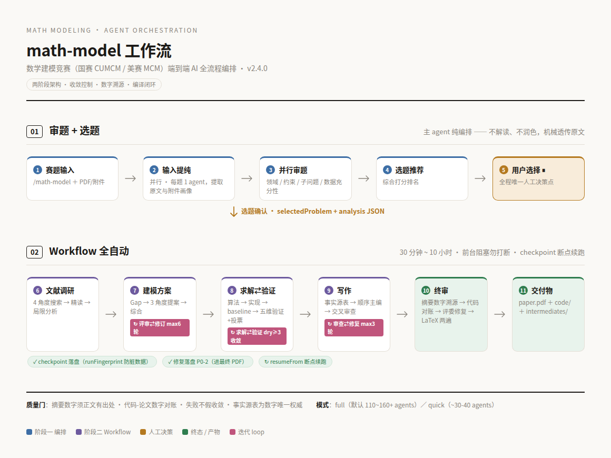
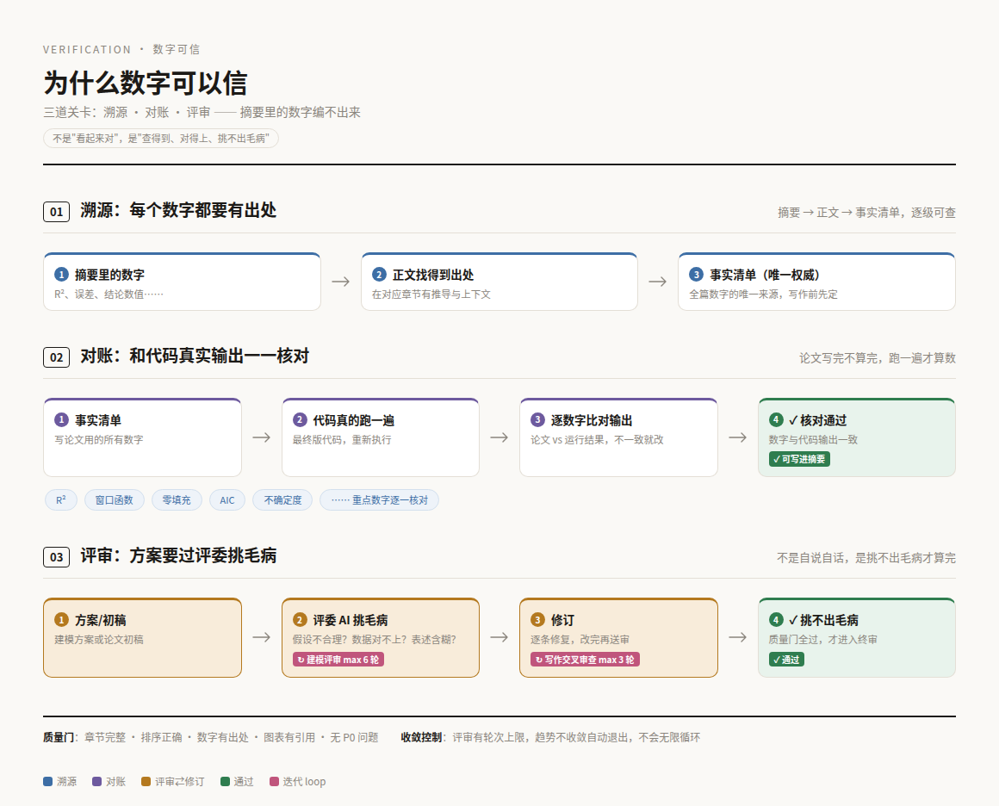
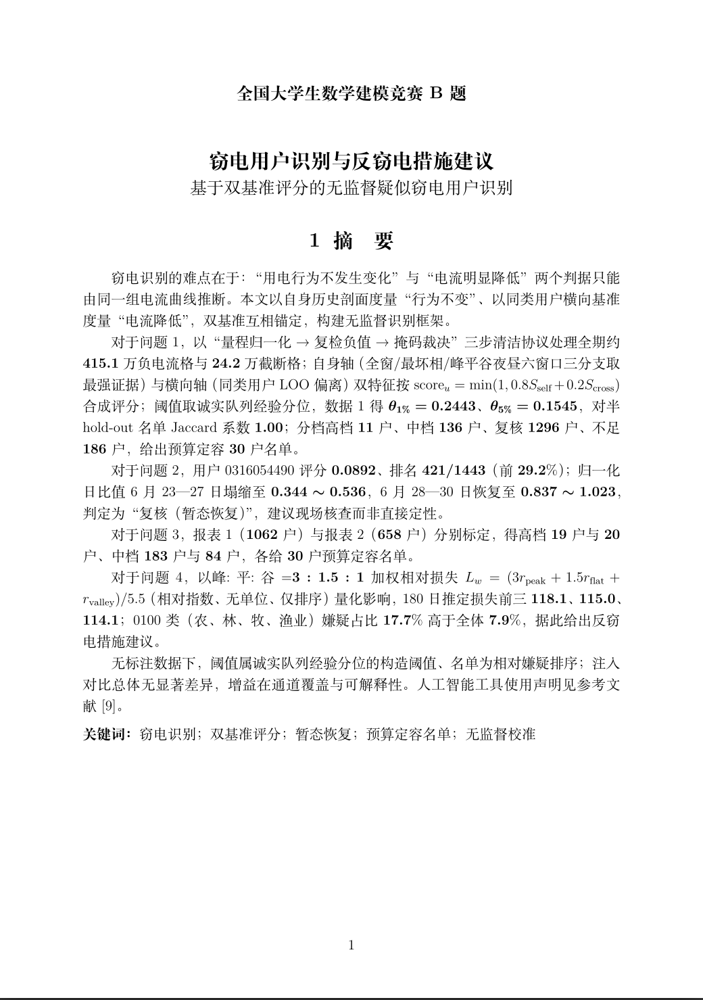

# 我做了一个一键生成数模论文的 skill

数学建模比赛（国赛 CUMCM / 美赛 MCM），简单说就是：给你一道现实问题——比如预测一个城市的出租车需求量、给超市设计补货策略、规划无人机的最优巡检路线——让你用数学方法分析它，最后交一篇论文。听起来很酷，但第一次参赛的人都知道，这条路全是坑：

- **题目读不懂**：一堆术语和表格，不知道从哪下手
- **选哪道题全凭运气**：选错了，三天都跟一道没思路的题死磕
- **代码跑不通**：想出来的模型写不出来，写出来又报错
- **论文格式靠猜**：摘要页、页边距、附录、参考文献，评委的要求像天书
- **更糟的是**：忙了三天，交上去的论文数字前后对不上，直接被扣分

所以我做了个东西：**把题目丢给它，几个小时后，一篇能直接提交的论文 PDF 就出来了**。中间查资料、想方案、写代码、算结果、写论文、排版，全自动。你不用懂数学建模，不用会写代码，甚至不用知道 LaTeX 是什么。

## 你要做的只有一件事：选做哪道题

拿到题目后，它会先派几个 agent 分工干活：

- 一个负责把题目原文完整抄下来——一个字不改，防止理解偏差
- 一个分析每道题：数据够不够、有几个小问、难在哪、适合用什么方法
- 一个综合推荐：哪道好上手、哪道适合冲奖、哪道数据里有坑

然后它把每道题的利弊摆在你面前，问你：做哪道？

你选完，剩下的全交给它。整个流程里，这是**唯一需要你动脑的决策**——而且这个决策本来就该由人做：你想稳稳拿奖还是搏一把、擅长什么方向，它猜不到，只有你知道。

## 后台发生了什么

你选完题之后，后台发生的大致是这些事：

- **查资料**：多个 agent 分头搜文献，看看这类问题别人怎么解决的，哪些方法经过验证能直接用，哪些还有改进空间。数模评委最看重"你的方法有没有依据"，而不是凭空发明。
- **定方案**：先提出几个不同的思路，然后交给评审 agent 挑毛病：这个假设现实吗？数据这样处理合理吗？方法会不会太旧？改完再送审，最多 6 轮，直到挑不出毛病才动笔。
- **写代码求解**：方案定了，真的把代码写出来、跑起来，算出结果。不是纸上谈兵，是实实在在跑出数字。
- **验证**：从好几个角度检查结果靠不靠谱——和简单的基准方法比一比（连基准都打不过，说明方法有问题）、交叉验证防止结果只是碰运气、检查模型是不是在背数据而不是学规律。不行就回头改，直到数据说话。
- **写论文**：先列一张"事实清单"——所有要用到的数字和结论先定下来；再一章一章写，写完交叉检查一遍，保证前后一致、逻辑通顺。
- **终审 + 排版**：最后一道关：摘要里每个数字都在正文有出处，还要和代码真正跑出来的结果一一核对。没问题了，自动排成符合国赛格式的 PDF。

全程由 30~160 个 agent 分工协作，你只需要等结果。



## 为什么数字可以信

直接跟 AI 说"帮我写篇数模论文"，你会得到一篇读起来很顺的论文——但数字可能是编的。评委最恨的就是这个：摘要写了个漂亮的结果，正文里找不到推导，代码一跑对不上。

同样是让 AI 干活，它把"数字可信"做成了三道硬性检查：

1. **溯源**：摘要里的每个数字，都要能在正文找得到出处，再往前推，来自写作前就定好的"事实清单"。正文查得到，才准写进摘要。
2. **对账**：论文写完了不算完，把最终版代码重新跑一遍，把输出和论文里的数字逐一对——R²、误差、各种指标，对不上的必须改，想编也编不出来。
3. **评审**：方案和论文都要过评审 agent 反复挑毛病，不是自说自话。建模方案最多改 6 轮，写好的稿子还要交叉审查最多 3 轮，直到挑不出毛病。

再加上格式是固化的国赛模板：摘要单独一页、不超过 20 页、附录带源代码和 AI 使用声明——新手最容易踩的坑，都提前填好了。



## 它和"直接问 AI"到底有什么区别

| | 直接问 AI | 用这个 skill |
|---|---|---|
| 思路 | 一篇"看起来对"的泛泛而谈 | 查过文献、过过评审的完整方案 |
| 数字 | 可能是编的 | 每个数字在正文有出处，和代码运行结果对得上 |
| 代码 | 大概率没跑过 | 真的跑起来，跑不通就改到通 |
| 论文 | 格式靠猜 | 国赛模板固化，直接出 PDF |
| 中途断了 | 白干 | 自动存档，接着跑 |

## 你能拿到什么



一篇论文 PDF + 可编辑的论文源文件，还有真实跑过的代码、图表、中间数据。想重新跑一遍、想改、想学，都行——比赛完复盘，这就是最好的学习材料。

## 怎么用

两条命令装好：

```bash
git clone git@github.com:Miaotofu01/Math-Model-SKILL.git ~/math-model-skill
bash ~/math-model-skill/install.sh
```

然后在支持的 AI 工具（比如 DeepSeek Harness、Claude Code）里输入 `/math-model`，把题目（PDF 或文字）发过去就行。

几个常用选项：

- **国赛还是美赛**：默认国赛（中文）；切到美赛，自动切换英文写作和美式排版
- **完整模式还是快速模式**：完整模式求稳，适合正式比赛；快速模式图快，适合赛前演练或先验证思路
- **中途断了**：每个环节都自动存档，恢复后接着跑，不用从头再来；换题目会自动清掉旧数据，不会串

## 实话实说

- **时间**：30 分钟到 10 小时，看题目难度。完整模式通常按小时算，因为要反复打磨；赶时间用快速模式，先出个初稿看看思路对不对。
- **花费**：会消耗 AI 算力额度。完整模式一次要用一百多个 agent，快速模式 30~40 个。问题越难、打磨越久，越贵。
- **环境**：需要电脑上有 PDF 读取、LaTeX 排版和 Python 科学计算环境。安装脚本会自动检测，缺啥会告诉你怎么装。
- **适合谁**：想拿奖、但不想把三天全耗在写代码和调格式上的人；也适合赛前想快速摸一遍流程的备赛选手。

## 写在最后

数学建模比赛比的不是谁代码写得漂亮，是谁能交出**站得住**的答案。这个 skill 不能替你"懂数学"，但它能把那些最耗时间、最容易出错、最没技术含量的活全部接管——你要做的，就是选一道题，然后等着收 PDF。

仓库：<https://github.com/Miaotofu01/Math-Model-SKILL>
